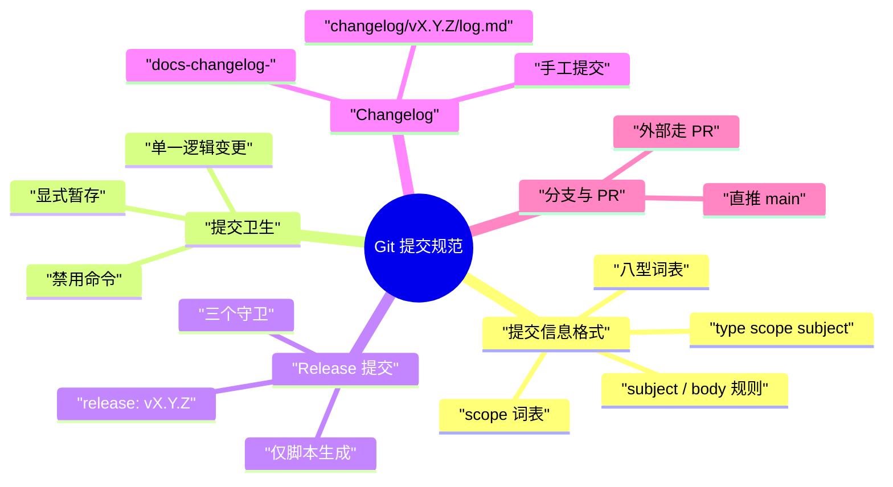

# ea-pi-extensions Git 提交规范

> [!note]
> **Ref:** `../../source/AGENTS.md`（上游惯例来源，pi 仓库）| [docs/发行版本控制策略.md](发行版本控制策略.md)（版本与发布语义）| [scripts/gcm.mjs](../scripts/gcm.mjs)（手动提交入口）| [scripts/mono-release.mjs](../scripts/mono-release.mjs) | [scripts/mono-sync.mjs](../scripts/mono-sync.mjs)



本规范与上游 pi 仓库同源：`type(scope): subject` 的格式与措辞惯例取自 pi 的 AGENTS.md 与提交历史，scope 词表按本仓库的四个包调整。**文档用中文，提交信息用英文**（与 pi 及本仓库现有提交一致，日志可 grep、gallery 国际化）。

## 提交信息格式

```
type(scope): subject
```

### type 词表（八型）

| type | 含义 | 示例 |
| --- | --- | --- |
| `feat` | 新功能、新包、新扩展 | `feat(pi-shelld): add TUI monitor for background shells` |
| `fix` | 缺陷修复 | `fix(pi-gadget): archive session on /clear` |
| `docs` | 文档与 changelog | `docs(changelog): v0.1.2` |
| `chore` | 杂务：依赖、元数据、基线对齐 | `chore: bump devDependencies` |
| `refactor` | 行为不变的重构 | `refactor(pi-shelld): extract poll loop` |
| `test` | 测试新增/修改 | `test(pi-switch-cwd): cover path edge cases` |
| `ci` | CI 流水线与发布管线 | `ci: publish the package named by the tag` |
| `release` | 发版提交——**仅由 mono-release.mjs 生成，禁止手写** | `release: v0.1.2` |

不预占 `perf` / `build` / `style` / `revert`：本仓库无对应场景，出现时归入最接近的既有类型并在 subject 说明。

### scope 词表

- **包名（单一包变更必填）**：`pi-gadget` / `pi-better-mermaid` / `pi-oc-go-luna-vision` / `pi-shelld` / `pi-switch-cwd`
- **跨切面**：`scripts`（工具脚本）、`ci`（workflow）、`docs`（文档）、`release`（发版流程）、`changelog`（发布说明）、`root`（根 manifest / workspace 配置）
- 同时涉及多个包或无法归属时**省略 scope**：`feat: ...`

### subject 规则

- 祈使句、小写开头、不超过 50 字符（pi 惯例：informative and concise）
- 说清**改了什么**，不说"改代码"：`fix(pi-shelld): drain zombie shells on session end` ✓，`fix stuff` ✗
- **禁止 emoji**（与 pi AGENTS.md 一致）
- 涉及 issue/PR 时以 `(#NNNN)` 结尾（外部 PR 场景）

### body 规则

非显然的变更写 body：**问题 → 具体示例或简短追踪 → 方案**，并说明为什么这个方案是必要的。跨包改动、事故修复、设计决策必须写。技术性叙述，直接，无客套（"Thanks" 之类废话不要）。

## 手动提交入口（gcm）

手工提交推荐走 `scripts/gcm.mjs`（`bun run gcm`），它负责本规范的前半段自动校验：

```bash
bun run gcm -- -t fix -p shelld -m "drain zombie shells on session end"
```

- `-t` 校验词表并归一别名（`chores` → `chore`）；`release` 一律拒绝（仅 mono-release 生成）
- `-p` 支持包名**模糊搜索**，非精确命中必须二次确认（TTY 交互选择 / 非交互 `-y`）
- `-m` 校验 ≤50 字符、小写开头、无 emoji（违规直接拦截，中文/大写首字母告警）
- `-c` changelog 骨架模式：`./gcm -c -p <pkg> --minor` 创建
  `changelog/<pkg>/vX.Y.Z/log.md` 骨架并打印提交提示（版本也可用
  `--patch/--major/--set-ver`，必须高于该包 registry 基线；只创建文件，
  不碰 git、不发版）
- 提交卫生由脚本强制：暂存区为空直接报错，且只提交暂存区（不替你 `git add`）
- `--dry` 验证模式：走完整校验 + 可达性检查（在仓库内、暂存区非空），只回显构造出的完整命令不落库
- `--print` 只输出拼好的提交信息不落库，供 agent/管道使用（与 `--dry` 同给时优先）

## 提交卫生

- **一个逻辑变更一个提交**；release 提交除外（脚本生成，天然原子）
- **显式暂存**：`git add <path1> <path2>`；禁止 `git add -A` / `git add .`（避免夹带他人/无关改动）
- 提交前 `git status` 核对暂存范围
- **禁止**：`git commit --no-verify`、`git reset --hard`、`git checkout .`、`git clean -fd`、`git stash`
- 工作区不留未提交改动跨 session——`mono-release.mjs` 会在发版时强制校验干净工作区，脏树直接中止

## Release 提交

发版提交由 `scripts/mono-release.mjs` 自动生成，人类不参与：

```text
release: pi-gadget@0.3.0                       ← 单包发版
release: pi-gadget@0.3.0, pi-shelld@0.1.2      ← 多包同发（一提交 + N 个 tag）
```

- 版本号只允许三条路径改动：`mono-sync`（`--sync` 落后对齐基线 / `--reset` 失败发布后
  领先复位基线，均自动 `bun install` 刷新 bun.lock）与 `mono-release`（bump + 提交 +
  tag + push）
- **禁止手写 `release:` 提交、禁止手工改 package.json 版本号**（绕过守卫 = 撞版本）
- 脚本内置守卫：干净工作区、本地版本 == 该包 registry 基线、该包自上个逐包 tag 以来
  有实质变更（无基线时仅告警）、changelog 已存在且含实质条目——被拦时按提示处理，不要绕过
- 逐包 tag 格式 `<pkg>@<ver>`（如 `pi-gadget@0.3.0`），tag 自身即 CI 发布指令
- 发版完整仪式见 [发行版本控制策略.md](发行版本控制策略.md)

## Changelog

无 CHANGELOG.md——tag + 每版发布说明即 changelog：

```text
changelog/
├── pi-gadget/
│   └── v0.3.0/
│       └── log.md      # 该包该版本的发布说明
└── ...
```

- **手工撰写、发版前提交**（Q：为何不是脚本生成？——发布说明需要人判断，脚本只负责版本仪式）
- 骨架生成：`./gcm -c -p <pkg> --minor` 创建 `changelog/<pkg>/vX.Y.Z/log.md` 并打印提交提示
- 提交格式：`docs(changelog): pi-gadget v0.3.0`，内容按 type 分组、引用提交 subject 提炼
- `mono-release.mjs` 硬性要求 `changelog/<pkg>/v<ver>/log.md` 已存在且含实质
  `-` 条目（`gcm -c` 的空骨架不含条目，会被拦下）
- 语言：中文（与 docs 一致；README/包描述保持英文面向 gallery）

```text
# pi-gadget v0.3.0

## feat
- pi_cite_wslpath: ...

## fix
- ...
```

## 分支与 PR

- **本仓库直推 main**（owner 单人流程，release 提交天然线性）
- **外部贡献走 PR**：fork + PR 到 main，owner 合入；合入前跑 `bun run typecheck`
- 个人功能分支命名建议 `<type>/<slug>`（如 `fix/shelld-zombie`），无强制
- PR 描述复用提交规范：说明问题 → 方案，附关键 diff 位置

## 正反例

| ✗ | ✓ |
| --- | --- |
| `fix stuff` | `fix(pi-shelld): drain zombie shells on session end` |
| `Update README.md` | `docs: add mono-sync usage to README` |
| `feat: 增加功能`（中文 subject） | `feat(pi-gadget): archive session on /clear` |
| `Release v0.1.2`（手写发版） | `release: pi-gadget@0.3.0`（仅脚本生成） |
| `fix: 🐛 fix shell bug`（emoji） | `fix(pi-shelld): reap dead children on exit` |
| `git add -A && git commit -m "wip"` | 显式暂存 + 单逻辑提交 |

## 与上游 pi 的关系

| 维度 | pi（../../source） | 本仓库 |
| --- | --- | --- |
| 格式 | `{feat,fix,docs}[(scope)]: subject` | 同源，八型词表 + 包名 scope |
| scope | 包名（ai/tui/agent/...） | 五包名 + scripts/ci/docs/release/changelog/root |
| release 提交 | maintainer 手动 `release: vX.Y.Z` | 脚本自动 `release: pi-gadget@0.3.0` |
| changelog | maintainer 维护 CHANGELOG.md | 每版 `changelog/<pkg>/vX.Y.Z/log.md` 手工提交 |
| 语言 | 英文 | 提交英文、文档中文 |
