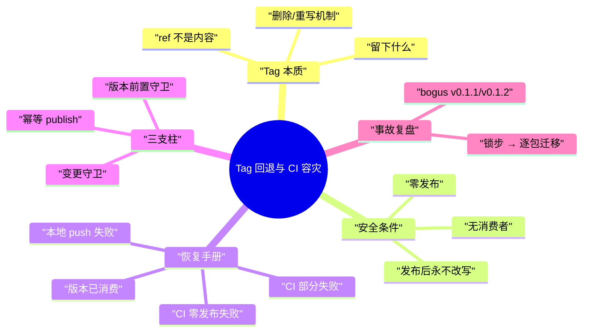

# ea-pi-extensions Tag 回退与 CI 容灾

> [!note]
> **Ref:** [docs/发行版本控制策略.md](发行版本控制策略.md)（版本语义与容灾矩阵，本文档是其操作手册）| [docs/git提交规范.md](git提交规范.md)（提交纪律）| [scripts/mono-release.mjs](../scripts/mono-release.mjs) | [.github/workflows/publish.yml](../.github/workflows/publish.yml)



本文档回答三个问题：**tag 回退到底做了什么**、**什么时候允许回退**、**CI 失败后按什么步骤恢复**。设计层面的矩阵见策略文档，这里是命令级操作手册。

## Tag 的本质与回退机制

> [!note]
>
> tag 是远端git引用 `git fetch --tags` 或`git pull` ,tag就会附着在本地git提交上。

**tag 是 ref（名字），不是内容**。删除 tag 只移除名字，被指向的提交对象永久保留在历史中：

```bash
git tag -d pi-gadget@0.3.0                       # 删本地 ref
git push origin :refs/tags/pi-gadget@0.3.0       # 空 refspec 推送 = 删远端 ref
```

删除后**留下**的东西（都无害，但要知道）：

| 留下什么 | 说明 |
| --- | --- |
| 提交对象 | 旧 Release 提交仍在 main 历史链上（普通祖先），`git log` 可见 |
| GitHub CI run 记录 | run 按 run-id 归档，不随 tag 消失（`gh run list` 仍能看到 failed 记录） |
| 他人的本地 ref | 曾 clone/fetch 过旧 tag 的仓库持有脏 ref（`git fetch --prune --tags` 可清） |

**重写语义**：删掉旧 tag 再推同名 tag = **同名不同提交**——这是 semver 惯例的例外操作，**正常发布后的 tag 永不改写**。

## 重写安全条件（三条全满足才允许）

1. **registry 零发布**：目标版本在该包上不存在

   ```bash
   npm view @yceachan/<pkg>@<version> version   # 有输出 = 已发布，禁止重写
   ```

2. **无外部消费者**：没有其他人 clone 过旧 tag（单人仓库默认成立；团队仓库须逐一确认）
3. **没有成功发布过**：该包该版本一旦发布，版本即已"消费"，只能走幂等 rerun / 补发

违反任一条件而重写 = 伪造已发布版本的历史来源（provenance 与 tag 对不上）。

## 恢复操作手册

### 场景 A：本地 push 失败（零发布，最轻）

`mono-release.mjs` 在 push 前已完成 commit + tag，脚本只是没推出去。**不要重跑 mono-release**（会再次 bump）：

```bash
git push && git push --tags     # 手工补推
# 若远端已前进（多机协作）：先 git pull --rebase 再推
```

### 场景 B：CI 检测/环境步失败（零发布）→ tag 重写

失败点在任何发布动作之前（如 tag 解析、manifest 校验、setup 步），registry 零发布。流程：

```bash
# 1. 确认零发布（安全条件 1）
npm view @yceachan/pi-gadget@0.3.0 version      # 期望报错（不存在）

# 2. 本地版本复位到该包 registry 基线（最高已发布版本）
bun run mono-sync -- --reset                     # 把领先包写回 registry 基线（失败发布的官方复位入口）

# 3. 删 tag（本地 + 远端）
git tag -d pi-gadget@0.3.0 && git push origin :refs/tags/pi-gadget@0.3.0

# 4. 修复问题并提交（按 git提交规范.md）
# 5. 重新走发版仪式
bun run mono-release -- pi-gadget minor
```

要点：删 tag 后该包无逐包 tag 基线，「自上个 tag 有变更」守卫降级为仅告警；基线守卫
（本地版本 == registry 基线）在 `--reset` 复位后通过。旧 Release 提交留在历史里成为
未打 tag 的普通提交，不影响后续。

### 场景 C：CI 发布步失败 → 幂等 rerun

单包发布模型下，「部分发布」缩小为两步之间的失败（如 publish 成功但 Release 页创建失败）。
publish 步骤幂等——`npm view` 已发布则跳过——rerun 天然安全：

```bash
gh run rerun <run-id>        # 或 GitHub UI: 失败 run → Re-run jobs
```

rerun 后观察日志：已发布则输出 `skip @yceachan/<pkg>@<ver> (already published)`，Release 页
补建。**唯一例外**：失败原因是 workflow 本身有 bug——rerun 用的是 tag 提交里的同一份
workflow，修 workflow 必须走场景 B 的 tag 重写；但版本已消费时重写被禁，此时只能手动补发：

```bash
npm login && npm publish --workspace=@yceachan/<pkg> --provenance --access public
```

（本地发布凭据是容灾例外，日常发布仍一律走 CI。）

### 场景 D：版本已消费且想"跳过"→ 死路

失败后想直接 bump 到下一版本绕过：**变更守卫会拦截**——该包自上个逐包 tag 以来无实质
变更，不发版。这是设计使然，不是 bug。唯一出路：等**新的包内容变更**落地后再发版
（新版本未发布，正常通过），或按场景 C 幂等 rerun。

## 容灾三支柱

| 支柱 | 位置 | 作用 |
| --- | --- | --- |
| 幂等 publish | `publish.yml` | `npm view` 存在即跳过——失败 = rerun 一次，不再是事故 |
| 变更守卫 | `mono-release.mjs` | 包自上个逐包 tag 无变更不发版——堵死"bump 绕过失败"的路径（无基线时降级为告警） |
| 版本前置守卫 | `mono-release.mjs` | 本地版本必须等于该包 registry 基线——从基线起跳使目标必然未发布，发布前拦截撞版本 |

三者互补成闭环：发布前拦截（前置守卫）→ 发布中可重试（幂等）→ 发布后不许绕过（变更守卫）。

## 事故复盘

### bogus v0.1.1 / v0.1.2（2026-08-12，锁步时代）

**发生了什么**：测试中推送了两个空 bump（`Release v0.1.1`、`Release v0.1.2`），CI 全部失败——
`changed` 输出是多行值，GITHUB_OUTPUT 拒绝（`Invalid format 'pi-oc-go-luna-vision'`）；
同时修复代码躺在工作区未提交，随 release 一起被遗漏。

**修复**：删除两个 tag 复位到 0.1.0 → 提交全部修复 → 重发 v0.1.1（成功，四包 + provenance）。
当时暴露的三个洞已分别堵上：多行输出、diff 包含 release 提交、脏工作区发版（干净树守卫）。

### 锁步 → 逐包迁移（2026-08-13）

**背景**：一个包的新功能拖全仓升 minor（v0.1.2 → v0.2.0 只为一个 pi-gadget 新工具），
锁步对无包间依赖的小工具集合收益为零。经 wayfinder 地图决策迁移至逐包独立版本。

**迁移内容**：根 manifest 删 version 改 private；各包版本复位到 registry 现状
（gadget 0.2.0 / mermaid 0.1.2 / 其余 0.1.1）；mono-release/mono-sync 逐包化；
publish.yml 改为 tag→直接发布（diff 检测删除）；旧 `v*` tag 保留为历史，不补建逐包 tag。

**教训**：发布管线是策略的产物——策略先行（wayfinder 地图定案）再动管线，避免脚本
反复推倒；迁移须与 registry 事实状态对齐，registry 是唯一事实源。
