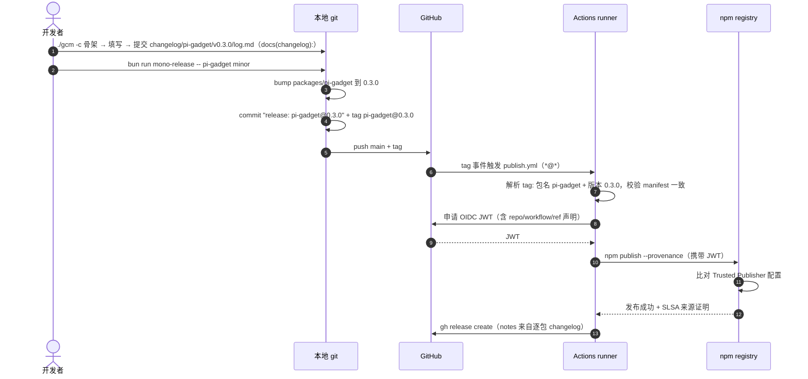

# ea-pi-extensions 版本控制策略

> [!note]
> **Ref:** [pi packages.md](https://github.com/earendil-works/pi/blob/main/packages/coding-agent/docs/packages.md) | [docs/git提交规范.md](git提交规范.md)（提交纪律）| [scripts/mono-release.mjs](../scripts/mono-release.mjs) | [scripts/mono-sync.mjs](../scripts/mono-sync.mjs) | [.github/workflows/publish.yml](../.github/workflows/publish.yml)

```mermaid
mindmap
  root((ea-pi-extensions 版本控制策略))
    "仓库结构"
      "bun workspaces 单仓"
      "五个 @yceachan 扩展包"
      "根 manifest 无版本"
    "版本策略"
      "逐包独立 semver"
      "registry 基线对齐"
      "tag 即发布指令"
      "历史: 锁步版本已退休"
    "发布管线"
      "release 脚本本地仪式"
      "逐包 tag 触发 CI"
      "OIDC 信任发布"
    "Changelog"
      "changelog/<pkg>/vX.Y.Z/log.md"
      "手工提交 docs(changelog):"
    "脚本用法"
      "mono-release.mjs"
      "mono-sync.mjs"
    "边界情况"
      "首发无基线"
      "失败重试"
```

ea-pi-extensions 是一个以 bun workspaces 组织的 pi 扩展 monorepo：五个扩展包**各自持有独立的 semver 版本**，按自身变更类型推进；发布由逐包 git tag（`<pkg>@<ver>`）驱动——tag 本身携带「发哪个包、哪个版本」的全部信息，CI 解析 tag 直接发布，无需 diff 检测。版本推进由两个脚本分工——`mono-sync.mjs` 负责逐包与 registry 基线的对齐，`mono-release.mjs` 负责发版仪式（bump、提交、tag、推送），实际发布由 GitHub Actions 在 tag 事件上以 OIDC 信任方式完成，本地不持有发布凭据。

> [!note]
> **历史**：2026-08-13 之前本仓采用**锁步版本**（全仓共享一个版本号，按需发布形成版本空洞）。
> 锁步对「无包间依赖的小工具集合」收益为零——一个包的新功能拖全仓升 minor。已切换至逐包独立版本，
> 旧 `v0.1.1/v0.1.2/v0.2.0` tag 保留为历史，不参与新管线。

## 仓库结构

```text
extensions/mono/                     # git 仓库 → github.com/yceachan/ea-pi-extensions
├── package.json                     # workspace 根：private、无 version，聚合脚本
├── bun.lock                         # 单一锁文件（各包不再持有独立 bun.lock）
├── README.md                        # 仓库说明（英文）
├── .gitignore
├── docs/
│   ├── 发行版本控制策略.md          # 本文档
│   └── git提交规范.md              # 提交纪律（type/scope、卫生、changelog）
├── changelog/
│   ├── v0.1.2/                      # 锁步时代的历史发布说明（保留）
│   ├── pi-gadget/
│   │   └── v0.3.0/
│   │       └── log.md               # 逐包发布说明（手工提交）
│   └── ...
├── scripts/
│   ├── mono-release.mjs                  # 发版：bump + release 提交 + 逐包 tag + push
│   └── mono-sync.mjs            # 逐包对齐 registry 基线（check / sync）
├── .github/workflows/
│   └── publish.yml                  # 逐包 tag 触发，解析 tag 直发，OIDC 发布
└── packages/
    ├── pi-gadget/                   # @yceachan/pi-gadget            （/clear、/exit、pi_cite_wslpath）
    ├── pi-better-mermaid/           # @yceachan/pi-better-mermaid    （mermaid 工具链）
    ├── pi-oc-go-luna-vision/        # @yceachan/pi-oc-go-luna-vision（视觉理解）
    ├── pi-shelld/                   # @yceachan/pi-shelld           （shell_daemon + ⭕shell）
    └── pi-switch-cwd/               # @yceachan/pi-switch-cwd       （/cwd）
```

### 包元数据约定

每个包遵循 pi packages.md 规范，保证被官方站点（pi.dev/packages）发现：

- `keywords` 含 `pi-package`
- `pi` 清单声明 extensions / skills
- 核心 pi 包（`@earendil-works/pi-ai`、`pi-agent-core`、`pi-coding-agent`、`pi-tui`、`typebox`）只进 `peerDependencies` 且用 `"*"`，不捆绑
- 第三方运行时依赖进 `dependencies`（pi install 会执行 npm install）
- `repository` + `homepage` 指向本仓库（npm 搜索质量分的关键信号）
- `files` 白名单控制发布物（TS 源码 + README，无构建步骤）
- `publishConfig.access: public`
- 描述与 README 以英文为主（gallery 面向国际展示）

## 版本推进策略

### 逐包独立 semver

五个包各自持有独立版本号，按**自身**的变更类型推进：

- patch：修 bug（0.1.2 → 0.1.3）
- minor：新功能（0.1.2 → 0.2.0）
- major：破坏性变更（0.1.2 → 1.0.0）

根 `package.json` 是纯 workspace 容器：`private: true`、**无 version 字段**，不参与发布。
包之间无版本耦合——一个包的新功能只推进它自己，其他包纹丝不动。

### tag 即发布指令

每次发布为该包打一个**逐包 tag**：

```text
pi-gadget@0.3.0        pi-shelld@0.1.2        pi-switch-cwd@1.0.0
```

- 格式 `<pkg>@<ver>`：包名不含 scope（scope 恒为 `@yceachan/`，仓内无歧义）
- 一次 release 可发多包：一个 release 提交 + N 个 tag，每个 tag 各自触发 CI
- CI 解析 tag → 校验 `packages/<pkg>/package.json` 版本 == tag 版本 → 直接发布该包。
  **没有 changed-package diff 检测**——tag 自身就是发布指令
- 轻量 tag（`git tag pi-gadget@0.3.0`），旧 `v*` tag 不再匹配 CI 触发 glob（`*@*`）

### 与 registry 的基线对齐

版本推进只发生在 release 流程中（mono-release.mjs 的 bump），但本地 manifest 可能落后于
registry（如从旧 tag 检出、手动发布过）。发布前以**该包自己的** registry 基线对齐：

- `mono-sync --sync`：查询每包已发布版本，把落后包对齐到自己的最高已发布版本
  （本地领先 registry = 发版未完成，拒绝降级）；对齐后**自动 `bun install` 刷新
  bun.lock**，并报告本地文件变动与仓库脏状态（只读 git status，不做任何 git 写操作）
- `mono-release.mjs` 内置前置守卫：目标版本已在该包 registry 存在则中止
- 对齐后 `mono-release -- <pkg> <bump>` 永远从该包 registry 基线起跳，不会撞已发布版本

### 与上游 pi 的版本关系

包对 pi 的依赖分两层：

- `peerDependencies`：`"*"`——接受宿主任意版本（packages.md 强制，插件惯例）
- `devDependencies`：`latest`——开发期跟随最新解析版本，不进发布物，不影响安装者

## 发布管线



### 各环节职责

| 环节 | 工具 | 职责 |
| --- | --- | --- |
| 版本编辑 | `mono-sync.mjs` | 逐包检查 / 对齐 registry 基线 + 自动刷新 workspace（bun install）+ 报告变动（只读 git status，不做 git 写操作） |
| 发版仪式 | `mono-release.mjs` | 逐包守卫 → bump → release 提交 → 逐包 tag → push |
| 发布执行 | `publish.yml`（GitHub Actions） | 解析 tag → manifest 一致性校验 → OIDC 认证 → `npm publish --provenance` → Release 页 |
| 信任配置 | npmjs.com Trusted Publisher | 每包一条：repo `yceachan/ea-pi-extensions` + workflow `publish.yml` |

本地**永不执行** `npm publish`——发布凭据只存在于 GitHub 与 npm 之间的 OIDC 信任链中。

### OIDC 信任发布

- workflow 声明 `permissions: id-token: write`，npm CLI 向 GitHub 申请 JWT，内含仓库、workflow、ref 声明
- registry 将 JWT 与预配置的 Trusted Publisher 逐字段比对，匹配才放行
- `--provenance` 生成 SLSA 来源证明，把 tarball 哈希绑定到源码提交

**已知限制**（npm 官方 issue #8544）：OIDC 不能用于包的**首次**发布——Trusted Publisher 配置页依附于包设置页，包不存在则无法配置。新包需先以传统方式（npm login + 2FA）手动种子发布一次。

### CI 干跑（dry run）

publish.yml 支持 `workflow_dispatch` 干跑：`tag` 输入 + `dry_run` 开关。走完整解析与
一致性校验，`npm publish` 与 `gh release create` 只回显不执行——策略/CI 改动落地前
用它验证管线，不产生任何发布副作用。

## 脚本用法

### mono-release.mjs

```bash
bun run mono-release -- pi-gadget minor                  # 单包发版
bun run mono-release -- pi-gadget minor pi-shelld patch  # 多包同发：一提交 + N tag
bun run mono-release -- pi-gadget minor --dry-run        # 完整守卫走查，不落任何改动
```

执行序列：参数解析（`<pkg> <bump>` 成对）→ 干净工作区守卫 → 逐包守卫（目标版本未在该包
registry 存在 / 该包自上个逐包 tag 以来有实质变更，无基线仅告警 / changelog 缺失仅告警 /
tag 未在本地存在）→ 写回各包版本 → `git commit -m "release: pi-gadget@0.3.0"` →
逐包 `git tag` → `git push && git push --tags`。脚本结束后 CI 自动接管发布。

前置条件：git 远端已配置、工作区无未提交改动（脚本强制）、每包 Trusted Publisher 已配置；
`changelog/<pkg>/vX.Y.Z/log.md` 建议提前手工提交（缺失只告警不拦截，见 git提交规范.md）。

### mono-sync.mjs

```bash
bun run mono-sync                      # 版本表：每包本地版本 vs 其 registry 基线
bun run mono-sync -- --check           # 门禁（有包低于基线 exit 1；领先仅告警）
bun run mono-sync -- --sync            # 对齐 + 自动刷新 workspace + 报告变动
bun run mono-sync -- --sync --dry-run  # 预览不写入
```

设计要点：

- 覆盖对象：`packages/*`（根 manifest 无版本，不参与）
- **不提供 bump / `--set`**——推进版本号是 release 语义，归 mono-release.mjs
- `--sync` 逐包查询 registry 最高已发布版本；本地高于基线时拒绝降级（提示先处理未完成的发布）
- `--sync` 对落后包：对齐 manifest 版本 → **自动 `bun install` 刷新 bun.lock**（使
  workspace 与新版本一致；`bun update` 对已发布的 workspace 成员会报 DependencyLoop，
  `bun install` 是 bun 原生的一致性对账入口）→ 打印本地文件变动与仓库脏状态提示
- 只编辑文件 + 只读 git status，不执行任何 git 写操作——与 mono-release.mjs 职责分离

### gcm（手动提交入口 + changelog 骨架）

```bash
./gcm -t fix -p shelld -m "drain zombie shells on session end"   # 复合提交
./gcm -c -p pi-gadget --minor               # 创建 changelog/<pkg>/v<ver>/log.md 骨架并打印提交提示
./gcm -c -p pi-gadget --set-ver 0.5.0       # 显式目标版本（--patch/--major 同构）
```

`-c` 是 changelog 骨架模式（原 `gbump -c`，发版前写发布说明属于提交工作流，故归入
手动提交入口）：目标版本由 `--patch/--minor/--major` 从本地版本推算或 `--set-ver` 指定，
必须高于该包 registry 基线；只创建文件、不碰 git、不发版，创建后打印
`./gcm -t docs -p changelog -m "<pkg> v<ver>"` 提交提示。

### gbump（手工发版一键入口）

```bash
./gbump -p pi-gadget --minor                     # 预检通过后执行发版仪式
./gbump -p pi-gadget --set-ver 0.5.0 --dry-run   # 显式目标版本 + 干跑
```

gbump 把发版前的三项人工检查自动化（失败即中止）：

1. **monorepo 干净**：`git status --porcelain` 为空
2. **版本与 registry 一致**：包本地版本 == 其 registry 基线（落后 → 提示
   `version:sync`；领先 → 提示按容灾手册处理未完成的发布）
3. **changelog 就绪且非空**：`changelog/<pkg>/v<ver>/log.md` 存在且含实质
   `-` 条目（骨架不含条目，不会误过检查）

预检通过后委托 mono-release 执行发版仪式；changelog 骨架由 `./gcm -c` 创建
（见上节），填写完成后按提示走 gcm 提交。

## 边界情况

| 场景 | 处理 |
| --- | --- |
| 首次发布 | 先手动种子发布该包（0.1.0）创建 registry 条目，配好该包 Trusted Publisher，再走逐包发版仪式 |
| 新包首个逐包 tag | 无 `<pkg>@*` 基线，「自上个 tag 有变更」守卫降级为仅告警 |
| CI 发布失败（零发布） | tag 重写：删 tag → 修好后重推同名 tag（workflow 重新触发）。安全条件：`npm view <pkg>@<ver>` 确认零发布、且无外部消费者抓过旧 tag（单人仓库成立；正常发布后 tag 永不改写） |
| CI 部分失败（发布成功但 Release 页失败等） | **rerun workflow 优先**（publish 循环幂等：已发布版本自动跳过）。禁止 bump 前进——新 release 的目标版本已存在，会被前置守卫拦截 |
| 本地 push 失败 | 零发布；手工 `git push && git push --tags` |
| changelog 未写 | 只告警不拦截；规范要求发版前手工提交 `docs(changelog): <pkg> vX.Y.Z` |
| tag 已存在 | 该版本已发过；换 bump 类型，或确认零发布后走 tag 重写（例外操作） |
| 本地落后 registry | `mono-sync -- --sync` 把落后包对齐到各自基线并自动刷新 workspace（bun install），审查变动后再走 release |
| 本地领先 registry | 上次发布未完成（如 CI 失败）；按容灾手册处理，`--sync` 会拒绝降级 |
| 新增包 | 加入 `packages/`（根 `workspaces` 通配已覆盖）；脚本自动发现，无需改清单 |

> 命令级恢复操作手册见 [docs/tag回退与CI容灾.md](tag回退与CI容灾.md)（场景 A-D 逐步命令）。
