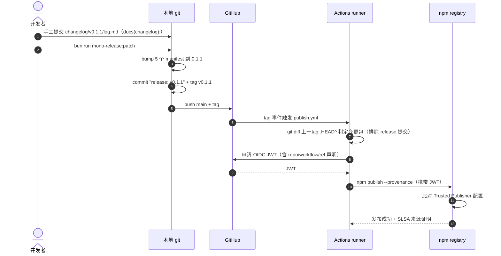

# ea-pi-extensions 版本控制策略

> [!note]
> **Ref:** [pi packages.md](https://github.com/earendil-works/pi/blob/main/packages/coding-agent/docs/packages.md) | [pi-agent 社区协作开发](../../pi-harness.iWonder/97-devp/pi-agent社区协作开发.md) | [docs/git提交规范.md](git提交规范.md)（提交纪律）| [scripts/mono-release.mjs](../scripts/mono-release.mjs) | [scripts/mono-sync.mjs](../scripts/mono-sync.mjs) | [.github/workflows/publish.yml](../.github/workflows/publish.yml)

```mermaid
mindmap
  root((ea-pi-extensions 版本控制策略))
    "仓库结构"
      "bun workspaces 单仓"
      "四个 @yceachan 扩展包"
      "脚本与 workflow"
    "版本策略"
      "锁步版本号"
      "按需发布"
      "registry 对齐"
      "版本空洞合法"
    "发布管线"
      "release 脚本本地仪式"
      "tag 触发 CI"
      "OIDC 信任发布"
    "Changelog"
      "changelog/vX.Y.Z/log.md"
      "手工提交 docs(changelog):"
    "脚本用法"
      "mono-release.mjs"
      "mono-sync.mjs"
    "边界情况"
      "首次发布"
      "失败重试"
```

ea-pi-extensions 是一个以 bun workspaces 组织的 pi 扩展 monorepo：四个扩展包共享同一版本号，发布时只发布有变更的包。版本推进由两个脚本分工——`mono-sync.mjs` 负责版本号的编辑与校验，`mono-release.mjs` 负责发版仪式（bump、提交、tag、推送），实际发布由 GitHub Actions 在 tag 事件上以 OIDC 信任方式完成，本地不持有发布凭据。

## 仓库结构

```text
extensions/mono/                     # git 仓库 → github.com/yceachan/ea-pi-extensions
├── package.json                     # workspace 根：workspaces ["packages/*"] + 聚合脚本
├── bun.lock                         # 单一锁文件（各包不再持有独立 bun.lock）
├── README.md                        # 仓库说明（英文）
├── .gitignore
├── docs/
│   ├── 发行版本控制策略.md          # 本文档
│   └── git提交规范.md              # 提交纪律（type/scope、卫生、changelog）
├── changelog/
│   └── v0.1.2/
│       └── log.md                  # 每版发布说明（手工提交）
├── scripts/
│   ├── mono-release.mjs                  # 发版：bump + release 提交 + tag + push
│   └── mono-sync.mjs            # 版本同步辅助：check / bump / set
├── .github/workflows/
│   └── publish.yml                  # tag 触发，diff 挑包，OIDC 发布
└── packages/
    ├── pi-gadget/                   # @yceachan/pi-gadget            （/clear、/exit）
    ├── pi-oc-go-luna-vision/        # @yceachan/pi-oc-go-luna-vision（视觉理解）
    ├── pi-shelld/                   # @yceachan/pi-shelld           （shell_daemon + ⭕shell）
    └── pi-switch-cwd/               # @yceachan/pi-switch-cwd       （/cwd）
```

### 包元数据约定

每个包遵循 pi packages.md 规范，保证被官方站点（pi.dev/packages）发现：

- `keywords` 含 `pi-package`
- `pi` 清单声明 extensions / skills
- 核心 pi 包（`@earendil-works/pi-ai`、`pi-agent-core`、`pi-coding-agent`、`pi-tui`、`typebox`）只进 `peerDependencies` 且用 `"*"`，不捆绑
- 第三方运行时依赖进 `dependencies`（pi install 会执行 npm install）
- `repository` + `homepage` 指向本仓库（npm 搜索质量分的关键信号）
- `files` 白名单控制发布物（TS 源码 + README，无构建步骤）
- `publishConfig.access: public`
- 描述与 README 以英文为主（gallery 面向国际展示）

## 版本推进策略

### 锁步版本号

五个 manifest——根 `package.json` 与四个包——**始终共享同一个版本号**。任何时刻不一致即为错误状态，`mono-sync --check` 用于检测，release 脚本在 bump 前强制校验。

### 按需发布

版本号每次全量推进，但发布只覆盖有变更的包：

- CI 以 `上一tag..HEAD` 的 git diff 判定变更包，仅发布命中者
- 未变更的包在 npm 上保持旧版本，形成**版本空洞**（如 pi-gadget 停在 0.1.1，其余已到 0.1.3）——这是设计允许的，下次该包变更时直接发布当前锁步版本
- 首次发布（无上一 tag）等价于"全部变更"，四包同发

### 与 registry 的基线对齐

版本推进只发生在 release 流程中（mono-release.mjs 的 bump），但本地 manifest 可能因各种原因落后于 registry（如从旧 tag 检出、部分包手动发布过）。发布前必须以 registry 为基线对齐：

- `mono-sync --sync`：查询四包已发布版本，取最高者统一写回五个 manifest（本地高于 registry 时拒绝降级）
- `mono-release.mjs` 内置前置守卫：目标版本已在任一包存在则中止，提示先 `--sync`
- 对齐后 `mono-release:patch` 永远从 registry 基线起跳，不会撞已发布版本

### 与上游 pi 的版本关系

包对 pi 的依赖分两层：

- `peerDependencies`：`"*"`——接受宿主任意版本（packages.md 强制，插件惯例）
- `devDependencies`：`latest`——开发期跟随最新解析版本，不进发布物，不影响安装者

## 发布管线



### 各环节职责

| 环节 | 工具 | 职责 |
| --- | --- | --- |
| 版本编辑 | `mono-sync.mjs` | 一致性检查、对齐 registry 最高已发布版本、指定版本（纯文件操作，不碰 git） |
| 发版仪式 | `mono-release.mjs` | 三守卫（一致性 / 干净工作区 / 非空发布）→ registry 前置守卫 → bump → release 提交 → tag → push |
| 发布执行 | `publish.yml`（GitHub Actions） | tag diff（排除 release 提交）挑包 → OIDC 认证 → `npm publish --provenance` |
| 信任配置 | npmjs.com Trusted Publisher | 每包一条：repo `yceachan/ea-pi-extensions` + workflow `publish.yml` |

本地**永不执行** `npm publish`——发布凭据只存在于 GitHub 与 npm 之间的 OIDC 信任链中。

### OIDC 信任发布

- workflow 声明 `permissions: id-token: write`，npm CLI 向 GitHub 申请 JWT，内含仓库、workflow、ref 声明
- registry 将 JWT 与预配置的 Trusted Publisher 逐字段比对，匹配才放行
- `--provenance` 生成 SLSA 来源证明，把 tarball 哈希绑定到源码提交

**已知限制**（npm 官方 issue #8544）：OIDC 不能用于包的**首次**发布——Trusted Publisher 配置页依附于包设置页，包不存在则无法配置。新包需先以传统方式（npm login + 2FA）手动种子发布一次。

## 脚本用法

### mono-release.mjs

```bash
bun run mono-release:patch    # 0.1.0 → 0.1.1（日常修 bug）
bun run mono-release:minor    # 0.1.0 → 0.2.0（新功能）
bun run mono-release:major    # 0.1.0 → 1.0.0（破坏性变更）
```

执行序列：参数校验 → 五 manifest 版本一致性校验 → **干净工作区校验**（有未提交改动即中止）→ **非空发布校验**（自上一 tag 以来 packages/ 无变更即中止）→ 计算新版本 → registry 前置守卫 → 写回 → `git commit -m "release: vX.Y.Z"` → `git tag vX.Y.Z` → `git push && git push --tags`。脚本结束后 CI 自动接管发布。

前置条件：git 远端已配置、工作区无未提交改动（脚本强制）、四包 Trusted Publisher 已配置；changelog/vX.Y.Z/log.md 建议提前手工提交（缺失只告警不拦截，见 [git提交规范.md](git提交规范.md)）。

内置前置守卫：目标版本 `vX.Y.Z` 已在任一包发布过时立即中止（提示先执行 `mono-sync --sync` 对齐），避免撞版本；registry 不可达时降级为警告并继续。

### mono-sync.mjs

```bash
bun run mono-sync                      # 版本表 + 一致性状态
bun run mono-sync --check              # 一致性门禁（不一致 exit 1）
bun run mono-sync -- --sync            # 对齐 registry 最高已发布版本
bun run mono-sync -- --set 0.2.0       # 全部设为指定版本
bun run mono-sync -- --sync --dry-run  # 预览不写入
```

设计要点：

- 包范围从根 `workspaces` 自动展开，新增包无需改脚本
- **不提供 bump 操作**——推进版本号是 release 语义，归 mono-release.mjs；本工具只负责检查与对齐
- `--sync` 查询四包 registry 已发布版本取最高者写回；本地高于 registry 时拒绝降级（提示先处理未完成的发布）
- 版本不一致时拒绝写入（防覆盖），`--dry-run` 可安全预览
- 只编辑文件，不执行 git 操作——与 mono-release.mjs 职责分离

## 边界情况

| 场景 | 处理 |
| --- | --- |
| 首次发布 | 先手动种子发布四个新包（0.1.0）创建 registry 条目，配好四包 Trusted Publisher，再 `mono-release:patch` 出 v0.1.1 四包同发 |
| CI 发布部分失败 | 手动补发失败包（`npm publish --workspace=@yceachan/<pkg>`），不要重跑 workflow——重跑会撞已发布版本 |
| 空发布（自上一 tag 无包变更） | release 脚本直接中止；changelog/docs/scripts 变更不构成发布理由 |
| changelog 未写 | 只告警不拦截；规范要求发版前手工提交 `docs(changelog): vX.Y.Z` |
| tag 已存在 | 该版本已发过；换 bump 类型，或确认无发布后清理本地与远端 tag |
| 版本不一致 | 手动对齐或 `--dry-run` 预览后 `--set`；release 脚本会拒绝执行 |
| 本地落后 registry | `mono-sync -- --sync` 对齐到最高已发布版本，再走 release |
| 本地领先 registry | 上次发布未完成（如 CI 失败）；先处理失败的发布，`--sync` 会拒绝降级 |
| 新增包 | 加入 `packages/` 并在根 `workspaces` 生效（`packages/*` 通配已覆盖）；同步更新 mono-release.mjs 的包清单 |

## 纪律清单

- 提交信息遵循 [git提交规范.md](git提交规范.md)：`type(scope): subject`，release 提交只由脚本生成
- 五个 manifest 版本号必须一致，发版前跑 `version:check`
- 发版前提交 changelog/vX.Y.Z/log.md（`docs(changelog):`）
- 发布前确保本地与 registry 对齐（`version:sync`），release 的前置守卫会强制这一点
- 禁止本地 `npm publish`；发布一律走 CI
- peerDependencies 保持 `"*"`，不随版本推进改动
- 包元数据（keywords / repository / files / 英文描述）是 gallery 发现与搜索评分的基础，新增包必须齐备
