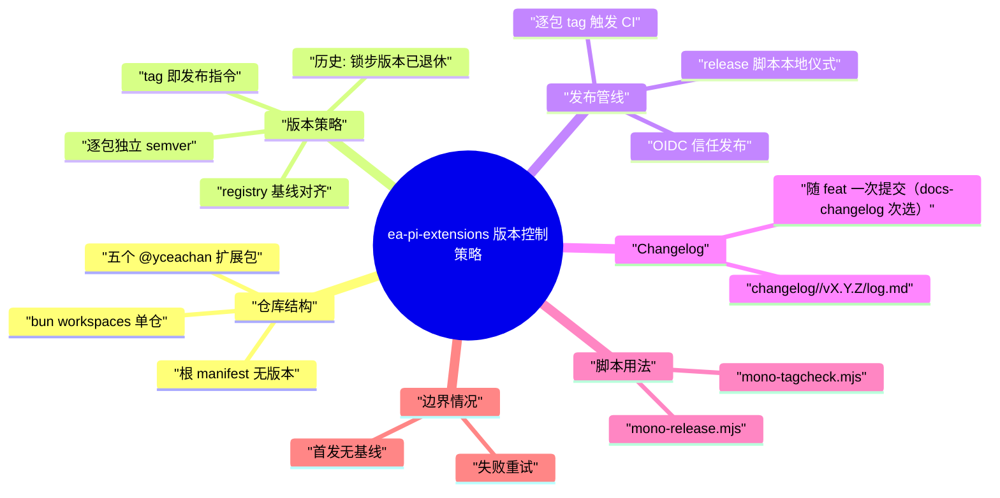
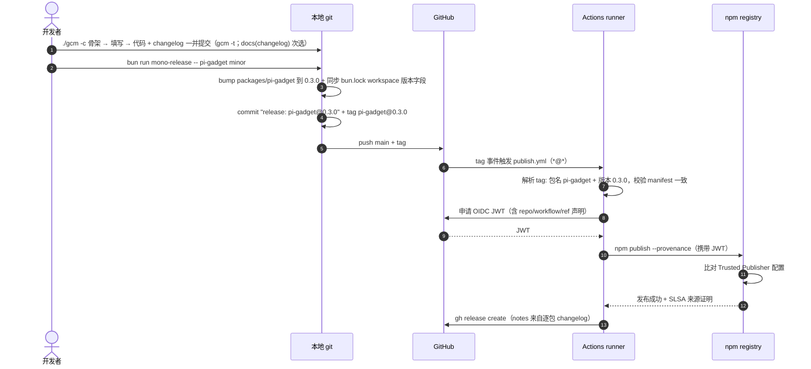

# ea-pi-extensions 版本控制策略

> [!note]
> **Ref:** [pi packages.md](https://github.com/earendil-works/pi/blob/main/packages/coding-agent/docs/packages.md) | [docs/git提交规范.md](git提交规范.md)（提交纪律）| [scripts/mono-release.mjs](../scripts/mono-release.mjs) | [scripts/mono-tagcheck.mjs](../scripts/mono-tagcheck.mjs) | [.github/workflows/publish.yml](../.github/workflows/publish.yml)



ea-pi-extensions 是一个以 bun workspaces 组织的 pi 扩展 monorepo：五个扩展包**各自持有独立的 semver 版本**，按自身变更类型推进；发布由逐包 git tag（`<pkg>@<ver>`）驱动——tag 本身携带「发哪个包、哪个版本」的全部信息，CI 解析 tag 直接发布，无需 diff 检测。版本推进由两个脚本分工——`mono-tagcheck.mjs` 只负责逐包 **version 号**的检查/对齐/复位（不做任何 git 版本控制），`mono-release.mjs` 负责发版仪式（bump、提交、tag、推送），实际发布由 GitHub Actions 在 tag 事件上以 OIDC 信任方式完成，本地不持有发布凭据。

> [!note]
> **历史**：2026-08-13 之前本仓采用**锁步版本**（全仓共享一个版本号，按需发布形成版本空洞）。
> 锁步对「无包间依赖的小工具集合」收益为零——一个包的新功能拖全仓升 minor。已切换至逐包独立版本，
> 旧 `v0.1.1/v0.1.2/v0.2.0` tag 保留为历史，不参与新管线。

### 包元数据约定

每个包遵循 pi packages.md 规范，保证被官方站点（pi.dev/packages）发现：

- `keywords` 含 `pi-package`
- `pi` 清单声明 extensions / skills
- 核心 pi 包（`@earendil-works/pi-ai`、`pi-agent-core`、`pi-coding-agent`、`pi-tui`、`typebox`）只进 `peerDependencies` 且用 `"*"`，不捆绑
- 第三方运行时依赖进 `dependencies`（pi install 会执行 npm install）
- `repository` + `homepage` 指向本仓库（npm 搜索质量分的关键信号）
- `files` 白名单控制发布物（TS 源码 + README，无构建步骤）
- `publishConfig.access: public`
- 描述与 README 以英文为主（gallery 面向国际展示）

## 版本推进策略

### 逐包独立 semver

包各自持有独立版本号，按**自身**的变更类型推进：

- patch：修 bug（0.1.2 → 0.1.3）
- minor：新功能（0.1.2 → 0.2.0）
- major：破坏性变更（0.1.2 → 1.0.0）

根 `package.json` 是纯 workspace 容器：`private: true`、**无 version 字段**，不参与发布。
包之间无版本耦合——一个包的新功能只推进它自己，其他包纹丝不动。

### tag 即发布指令

每次发布为该包打一个**逐包 tag**：

```text
pi-gadget@0.3.0        pi-shelld@0.1.2        pi-switch-cwd@1.0.0
```

- 格式 `<pkg>@<ver>`：包名不含 scope（scope 恒为 `@yceachan/`，仓内无歧义）
- 一次 release 可发多包：一个 release 提交 + N 个 tag，每个 tag 各自触发 CI
- CI 解析 tag → 校验 `packages/<pkg>/package.json` 版本 == tag 版本 → 直接发布该包。
  **没有 changed-package diff 检测**——tag 自身就是发布指令
- 轻量 tag（`git tag pi-gadget@0.3.0`），旧 `v*` tag 不再匹配 CI 触发 glob（`*@*`）

### Initial Publish
  
对于新增Package 的首次发版，不需要过gbump流水线，直接先`npm publish`后，在monorepo打上`tag: $PKG@Ver`，然后`git push origin Tag` 即可。
CI有幂等设计，npm reistry上已重复的版本，会跳过npm publish，不会阻碍后续的release page 生成。
### 与 registry 的基线对齐
版本推进只发生在 release 流程中（mono-release.mjs 的 bump），但本地 manifest 可能落后于
registry（如从旧 tag 检出、手动发布过）。发布前以**该包自己的** registry 基线对齐：

- `mono-tagcheck --sync`：查询每包已发布版本，把落后包对齐到自己的最高已发布版本
  （本地领先 registry = 发版未完成，拒绝降级）；对齐后**自动 `bun install` 刷新
  bun.lock**，并报告本地文件变动与仓库脏状态（只读 git status，不做任何 git 写操作）
- `mono-release.mjs` 内置基线守卫：本地版本必须等于该包 registry 基线（落后/领先均中止）
- 对齐后 `mono-release -- <pkg> <bump>` 永远从该包 registry 基线起跳，不会撞已发布版本

### 与上游 pi 的版本关系

包对 pi 的依赖分两层：

- `peerDependencies`：`"*"`——接受宿主任意版本（packages.md 强制，插件惯例）
- `devDependencies`：**`^` 范围声明当前 pi 发布版本**（如 `"^0.84.2"`）——不进发布物、
  不影响安装者。**禁 `latest`**：它是唯一每次安装都重新求值的动态声明，上游发新版后任何
  push 的 `bun install --frozen-lockfile`（ci 门禁）都会失败（2026-08-14 上游发 0.84.2 后，
  pi-gadget@0.2.1 与 pi-better-mermaid@0.1.3 两个 release 提交的 ci 均因此挂掉）；
  `^` 是静态区间，且锁文件在范围内粘性（普通 install 不重解析），frozen 门禁恒绿——
  跟随上游 = 范围内 `bun update` 或跨 minor 改范围 + 提交锁文件

## 发布管线



### 各环节职责

| 环节 | 工具 | 职责 |
| --- | --- | --- |
| 版本号维护 | `mono-tagcheck.mjs` | 只调整各包 manifest 的 version 号：逐包检查 / 对齐 / 复位 registry 基线 + 自动刷新 workspace（bun install）+ 报告变动；不 commit / 不 tag / 不 push |
| 发版仪式 | `mono-release.mjs` | 逐包守卫 → bump + 同步 bun.lock 版本字段 → release 提交 → 逐包 tag → push |
| 发布执行 | `publish.yml`（GitHub Actions） | 解析 tag → manifest 一致性校验 → OIDC 认证 → `npm publish --provenance` → Release 页 |
| 信任配置 | npmjs.com Trusted Publisher | 每包一条：repo `yceachan/ea-pi-extensions` + workflow `publish.yml` |

本地**永不执行** `npm publish`——发布凭据只存在于 GitHub 与 npm 之间的 OIDC 信任链中。

### OIDC 信任发布

- workflow 声明 `permissions: id-token: write`，npm CLI 向 GitHub 申请 JWT，内含仓库、workflow、ref 声明
- registry 将 JWT 与预配置的 Trusted Publisher 逐字段比对，匹配才放行
- `--provenance` 生成 SLSA 来源证明，把 tarball 哈希绑定到源码提交

**已知限制**（npm 官方 issue #8544）：OIDC 不能用于包的**首次**发布——Trusted Publisher 配置页依附于包设置页，包不存在则无法配置。新包需先以传统方式（npm login + 2FA）手动种子发布一次。

### CI 干跑（dry run）

publish.yml 支持 `workflow_dispatch` 干跑：`tag` 输入 + `dry_run` 开关。走完整解析与
一致性校验，`npm publish` 与 `gh release create` 只回显不执行——策略/CI 改动落地前
用它验证管线，不产生任何发布副作用。

## 脚本用法

### mono-release.mjs

```bash
bun run mono-release -- pi-gadget minor                  # 单包发版
bun run mono-release -- pi-gadget minor pi-shelld patch  # 多包同发：一提交 + N tag
bun run mono-release -- pi-gadget minor --dry-run        # 完整守卫走查，不落任何改动
```

执行序列：参数解析（`<pkg> <bump>` 成对）→ 干净工作区守卫 → README 包清单同步守卫
（`./sync-readme --check`，过期即中止；新增包必须先登记进 README 再发版）→ 逐包守卫（本地版本 == 该包
registry 基线 / 该包自上个逐包 tag 以来有实质变更，无基线仅告警 / changelog 已存在且含
实质条目 / tag 未在本地存在）→ 写回各包版本 + 手术式同步 bun.lock 的 workspace 版本
字段（不跑 bun install，避免重解析依赖树、把无关变动夹带进 release 提交——pi-core
用 `^` 范围 + 锁文件粘性，解析稳定，该手术式同步与 frozen 解析天然一致）→ `git commit -m "release: pi-gadget@0.3.0"` →
逐包 `git tag` → `git push && git push --tags`。脚本结束后 CI 自动接管发布。

前置条件：git 远端已配置、工作区无未提交改动（脚本强制）、每包 Trusted Publisher 已配置；
`changelog/<pkg>/vX.Y.Z/log.md` 须先于发版提交且含实质条目（推荐随代码改动一次提交，
次选单独 `docs(changelog)` 提交；缺失或空骨架脚本即中止，见 git提交规范.md）。

### mono-tagcheck.mjs

```bash
bun run mono-tagcheck                     # 版本表：每包本地版本 vs 其 registry 基线
bun run mono-tagcheck -- --check          # 门禁（有包低于基线 exit 1；领先仅告警）
bun run mono-tagcheck -- --sync           # 对齐 + 自动刷新 workspace + 报告变动
bun run mono-tagcheck -- --reset          # 失败发布后：领先包复位回基线 + 自动刷新 workspace
bun run mono-tagcheck -- --sync --dry-run # 预览不写入
```

设计要点：

- **只动版本号，不做版本控制**：唯一作用是把各包 manifest 的 version 号与 registry
  基线对齐；不 commit / 不 tag / 不 push / 不建分支——git 只有只读 status 用于报告。
  版本控制（bump → 提交 → 逐包 tag → push）是 mono-release.mjs 的职责
- 覆盖对象：`packages/*`（根 manifest 无版本，不参与）
- **不提供 bump / `--set`**——推进版本号是 release 语义，归 mono-release.mjs
- `--sync` 逐包查询 registry 最高已发布版本；本地高于基线时拒绝降级（提示先处理未完成的发布）
- `--reset` 只复位领先包（本地 > 基线）回基线，有落后包时拒绝（先 `--sync`）——
  目标必是已发布的基线版本，永不产生新版本；与 `--sync` 互斥
- `--sync` 对落后包：对齐 manifest 版本 → **自动 `bun install` 刷新 bun.lock**（使
  workspace 与新版本一致；`bun update` 对已发布的 workspace 成员会报 DependencyLoop，
  `bun install` 是 bun 原生的一致性对账入口）→ 打印本地文件变动与仓库脏状态提示
- 只编辑文件 + 只读 git status，不执行任何 git 写操作——与 mono-release.mjs 职责分离

### sync-readme.mjs

```bash
./sync-readme                          # 重建两个 README 的包清单表格与安装块并写入
./sync-readme --dry                    # 只预览，不落盘
./sync-readme --check                  # 门禁：一致 → 输出 "on date" 退出 0；
                                       # 过期 → 输出 "out of date" 退出 1
```

只维护 `README.md` / `README.zh-CN.md` 的包清单表格（`## Packages`，结构以 zh 为准：英文章节标题）
与安装代码块（`## Install`），其余章节不碰：包清单取 `packages/*` 实际目录（字典序），说明列
既有行原样搬移 README 里手工维护的描述（zh 中文 / en 手工描述，脚本不拥有它），新包回退
`package.json` 的 `description`（无译稿层）；gallery 链接逐包生成
`https://pi.dev/packages/@yceachan/<pkg>`，安装块逐包生成 `pi install npm:@yceachan/<pkg>`。
连续空行差（排版偏好）不参与 on date 判定，不会改写用户已有排版。
`--check` 是门禁模式：mono-release 发版守卫第一道前置检查即跑它——README 过期（如新增包
未登记）直接拒绝发版，先运行 `./sync-readme` 重建后重试；配合 CI 或 hook 亦可定时段检查。

### gcm（手动提交入口 + changelog 骨架）

```bash
./gcm -t fix -p shelld -m "drain zombie shells on session end"   # 复合提交
./gcm --list                                 # 列出全部 packages@versions
./gcm -c -p pi-gadget --minor               # 创建 changelog/<pkg>/v<ver>/log.md 骨架并打印提交提示
./gcm -c -p pi-gadget --set-ver 0.5.0       # 显式目标版本（--patch/--major 同构）
```

`-c` 是 changelog 骨架模式（原 `gbump -c`，发版前写发布说明属于提交工作流，故归入
手动提交入口）：目标版本由 `--patch/--minor/--major` 从本地版本推算或 `--set-ver` 指定，
必须高于该包 registry 基线；只创建文件、不碰 git、不发版，创建后打印提交提示——
**推荐工作流优先**：feat 开发完成时先建骨架，填写后代码与 changelog 一并 `git add` +
`./gcm -t <type> -p <pkg>` 一次提交；**次选**（代码已提交）才走
`./gcm -t docs -p changelog -m "<pkg> v<ver>"` 单独提交。
`-p` 的模糊搜索支持二级匹配 packages/*/ 下裸根 .ts 小工具并归到母包
（`-p cite-wslpath` → `pi-gadget`），TTY 下回车确认首选 / 输入序号或完整包名；
`--list` 列出全部 packages@versions。

### gbump（手工发版一键入口）

```bash
./gbump -p pi-gadget --minor                     # 一键发版（守卫内建于 mono-release）
./gbump -p pi-gadget --set-ver 0.5.0 --dry-run   # 显式目标版本 + 干跑
./gbump -p pi-visio --minor -y                   # 模糊匹配: 唯一候选 + 非交互需 -y
```

gbump 是 **mono-release 的薄壳入口**：只把 `-p <pkg> --patch|--minor|--major|--set-ver`
翻译成 mono-release 的位置参数后直接委托，不持有任何独立逻辑。发版前的全部守卫
（干净工作区 / 本地版本 == registry 基线 / changelog 就绪且非空 / 自上个逐包 tag
有变更 / tag 未存在）都内建于 mono-release，全仓库只有一份实现。changelog 骨架由
`./gcm -c` 创建（见上节），填写完成后按提示走 gcm 提交。

`-p` 支持模糊匹配，与 gcm 共享 scripts/lib.mjs 的 `resolvePackageScope` 一份实现：
仅匹配 packages/* 包名（无跨切面词表；二级小工具名映射到母包，如
cite-wslpath → pi-gadget），TTY 下回车确认首选 / 输入序号或完整包名，
非交互下唯一候选需 `-y` 接受、多候选必须用完整包名；解析出完整包名后才委托
mono-release（mono-release 保持精确匹配——它是批式位置参数 CLI，模糊化会让多包
解析歧义）。

### zsh 补全（gbump / gcm）

补全文件在 `scripts/completions/_gbump`（`#compdef gbump gcm`）：flags 词表随两个
脚本的 --help 同步，`-p` 的包名候选动态扫描 packages/*（gcm 另附跨切面词表
scripts/ci/docs/release/changelog/root）；仓库根由补全文件在 fpath 中的位置推导，
不依赖调用时 cwd。安装：把该目录加入 fpath（须在 compinit 之前），
如 oh-my-zsh 用户在 `source $ZSH/oh-my-zsh.sh` 前加：

```zsh
fpath+=("$HOME/work/pi-agent-harness/extensions/mono/scripts/completions")
```

## 边界情况

| 场景 | 处理 |
| --- | --- |
| 首次发布 | 先手动种子发布该包（0.1.0）创建 registry 条目，配好该包 Trusted Publisher，再走逐包发版仪式 |
| 新包首个逐包 tag | 无 `<pkg>@*` 基线，「自上个 tag 有变更」守卫降级为仅告警 |
| CI 发布失败（零发布） | tag 重写：删 tag → 修好后重推同名 tag（workflow 重新触发）。安全条件：`npm view <pkg>@<ver>` 确认零发布、且无外部消费者抓过旧 tag（单人仓库成立；正常发布后 tag 永不改写） |
| CI 部分失败（发布成功但 Release 页失败等） | **rerun workflow 优先**（publish 循环幂等：已发布版本自动跳过）。禁止 bump 前进——该包自上个逐包 tag 无新变更，变更守卫会拦截 |
| 本地 push 失败 | 零发布；手工 `git push && git push --tags` |
| changelog 未写 | 硬失败：缺失或空骨架即中止。先 `./gcm -c` 骨架 → 填写 → 与代码改动一并提交（次选 `docs(changelog): <pkg> vX.Y.Z`）。CI 侧 Release 页在 notes 缺失时仍回退 `--generate-notes`——那是手工 tag 的最后防线，正常发版路径已被本地硬守卫拦截 |
| tag 已存在 | 该版本已发过；换 bump 类型，或确认零发布后走 tag 重写（例外操作） |
| 本地落后 registry | `mono-tagcheck -- --sync` 把落后包对齐到各自基线并自动刷新 workspace（bun install），审查变动后再走 release |
| 本地领先 registry | 上次发布未完成（如 CI 失败）；按容灾手册用 `mono-tagcheck -- --reset` 复位到基线，`--sync` 拒绝降级 |
| pi 上游发布新版本 | 不 bump 则 CI 恒绿（`^` 范围 + 锁文件粘性，上游漂移不再隐式破坏 frozen-lockfile 门禁）。跟随上游：范围内 `bun update <pkg>` 或跨 minor 改 manifest 范围（如 `^0.84.2` → `^0.85.0`）+ `bun install` 提交锁文件 |
| 新增包 | 加入 `packages/`（根 `workspaces` 通配已覆盖）；脚本自动发现，无需改清单 |

> 命令级恢复操作手册见 [docs/tag回退与CI容灾.md](tag回退与CI容灾.md)（场景 A-D 逐步命令）。
