# pi-better-mermaid 能力检测归档

检测时间：2025-08-13（mermaid@11.15.0，mmdc @mermaid-js/mermaid-cli@11.15.0）
检测方式：better-mermaid 工具逐类校验（mmdc 渲染 + lint 硬规则），全部通过后归档。
归档内容：本 md（可渲染的 ```mermaid 图块）+ 同名 `.mmd` 裸源（mmdc 复现用）+ `.svg` 渲染产物。

## 结果一览

| #  | 类型                | 尝试 | 建模主题                                        | 备注 |
| -- | ------------------- | ---- | ----------------------------------------------- | ---- |
| 01 | sequenceDiagram     | 1    | 用户请求 → 起草 → 校验 → 重试 → 归档 时序       | box/alt/loop/rect/autonumber |
| 02 | stateDiagram-v2     | 1    | 图交付生命周期状态机                            | 复合态 + choice + notes |
| 03 | classDiagram        | 2    | 包模块结构与依赖                                | namespace/stereotype/基数 |
| 04 | erDiagram           | 1    | 归档数据形状                                    | PK/FK/识别性关系/注释 |
| 05 | flowchart           | 2    | mmdc 校验管线                                   | ELK/子图/扩展形状/粗箭头 |
| 06 | requirementDiagram  | 1    | 编码硬规则追溯                                  | satisfies/verifies/derives |
| 07 | gitGraph            | 1    | 包的分支合并历史                                | cherry-pick/tag/HIGHLIGHT |
| 08 | timeline            | 1    | mermaid 能力演进                                | section 分组 |
| 09 | gantt               | 1    | 检测排期计划                                    | after 依赖/crit/milestone |
| 10 | mindmap             | 1    | 技能知识地图                                    | root(( )) 形状 |
| 11 | C4Context           | 1    | pi 渲染生态上下文                               | 边界/SystemDb/SystemQueue |
| 12 | block               | 2    | 校验产物静态布局                                | columns/复合块/blockArrow |
| 13 | journey             | 1    | 用户画图体验评分                                | section + 评分 |
| 14 | quadrantChart       | 1    | 类型评估 2x2                                    | 16 个数据点 |
| 15 | sankey-beta         | 2    | 类型分发流量                                    | ⚠ 仅 ASCII 节点名 |
| 16 | xychart-beta        | 1    | 各类型校验尝试次数                              | bar + line |

16/16 全部通过；12 类一次通过，4 类（class/flowchart/block/sankey）首败后修复通过。`eventmodeling` 已弃用（11.15.0 渲染错误页，见坑 #8）。

## 01 · sequenceDiagram

意图：用户请求 mermaid 图后，agent 经 skill 起草、mmdc 校验（含失败重试循环）到归档的完整时序，明确用户侧与 agent 侧边界。

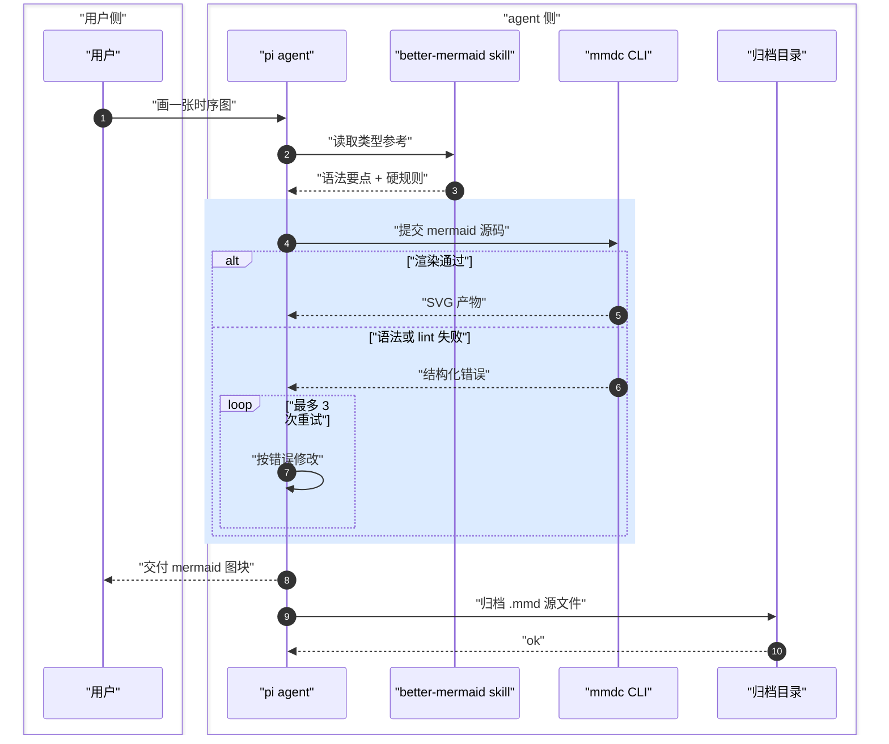

## 02 · stateDiagram-v2

意图：一张图从起草、自审、校验到交付归档的生命周期，突出校验失败回退与尝试次数守卫。

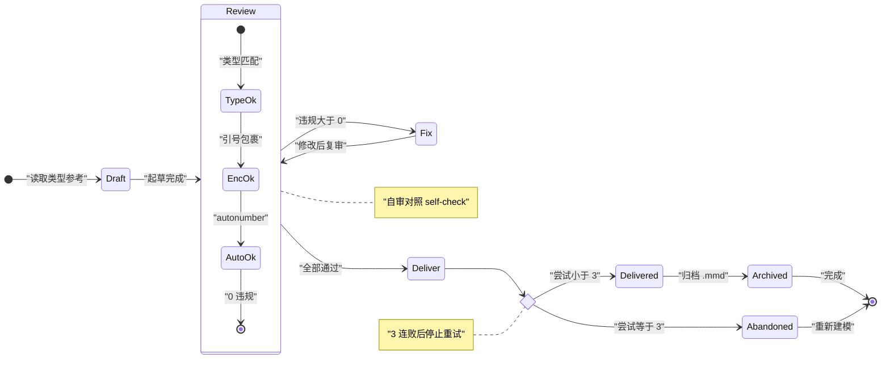

## 03 · classDiagram

意图：better-mermaid 包的模块结构：skill 本体、校验工具、lint 规则与参考文档之间的依赖与索引关系。

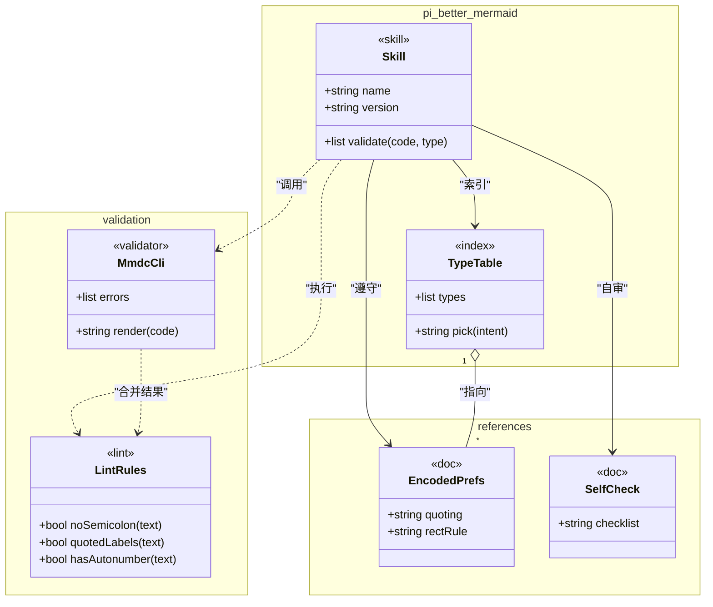

## 04 · erDiagram

意图：harness-eval 归档的数据形状：每张图经过多次校验、属于一种类型、受多条 lint 规则约束。

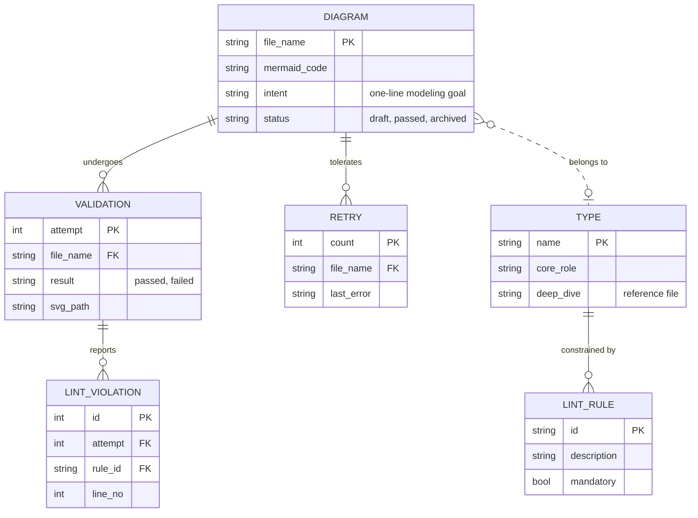

## 05 · flowchart

意图：mermaid 源码从输入、mmdc 语法校验（含失败重试循环）、lint 硬规则检查到 SVG 交付与归档的管线。

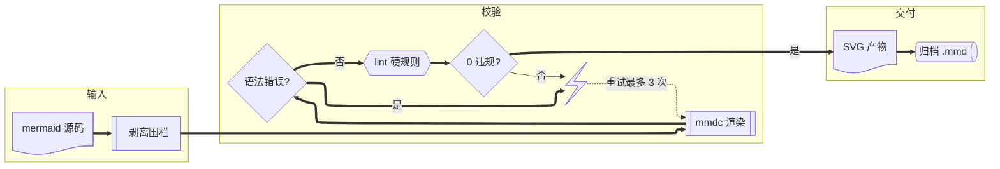

## 06 · requirementDiagram

意图：追溯技能的硬性编码需求（引号、无分号、autonumber、浅色 rect）如何被 lint 规则满足并被校验工具验证。

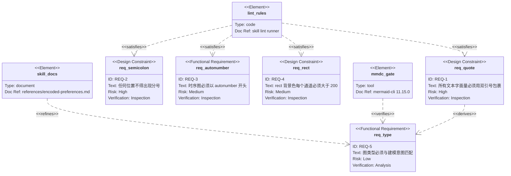

## 07 · gitGraph

意图：pi-better-mermaid 包的开发历史：三条特性分支经 cherry-pick 与 merge 汇入 main 并打版发布。

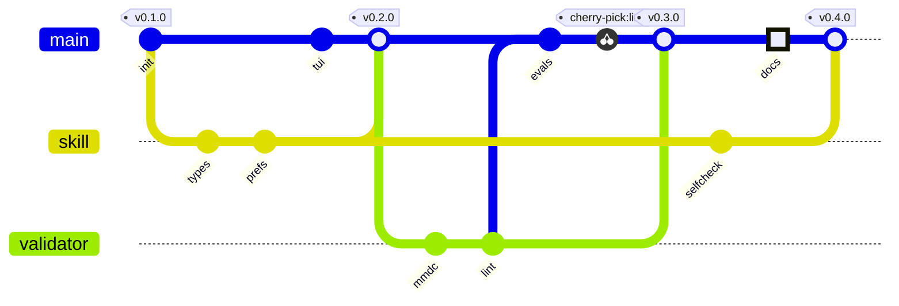

## 08 · timeline

意图：mermaid 渲染能力演进：从基础布局到 v11.15 的新图类型与语法能力，再到 pi 的 TUI 渲染与校验门禁集成。

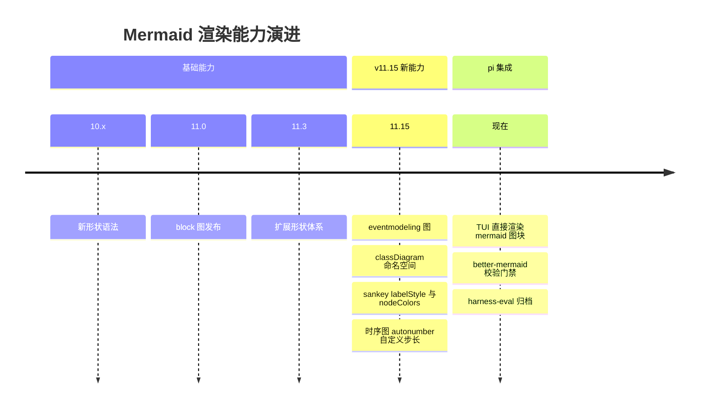

## 09 · gantt

意图：带依赖与里程碑的检测排期：准备 → 两批渲染测试 → 交付归档，突出关键路径。

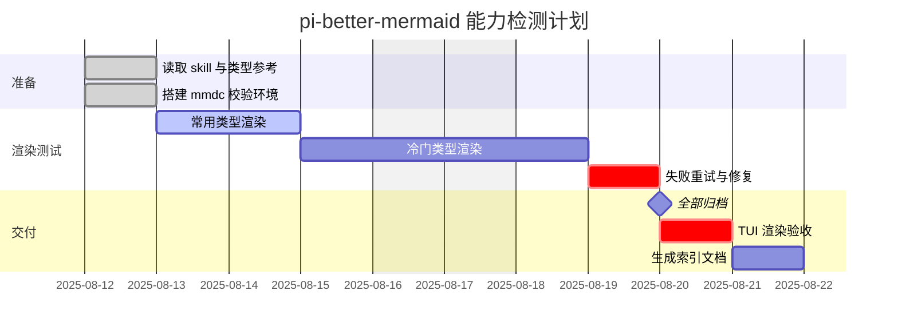

## 10 · mindmap

意图：技能知识结构：建模、表现力、编码、校验四大支柱及其子要点。

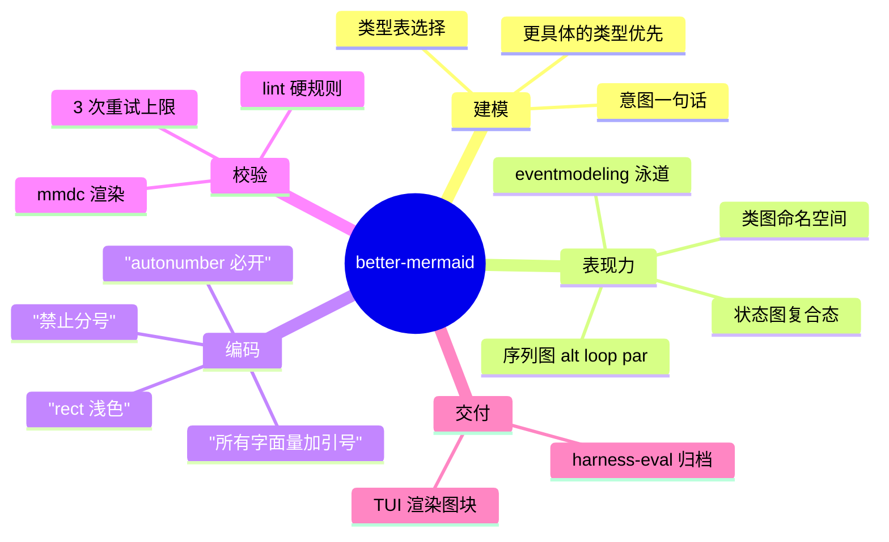

## 11 · C4Context

意图：pi 的 mermaid 渲染生态：用户与 pi TUI、skill、mmdc 校验门禁、归档目录之间的系统边界与交互。

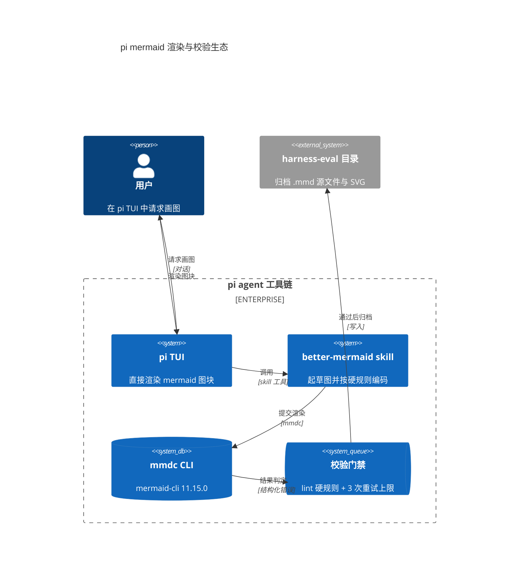

## 12 · block

意图：校验产物的静态排布：源码经复合校验块（渲染+lint）流到 SVG，失败走重试路径，最终归档。

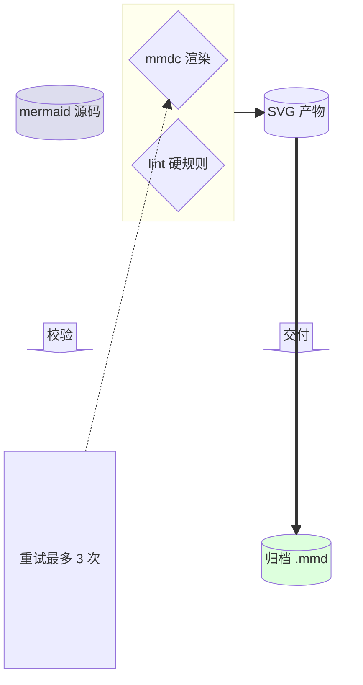

## 13 · journey

意图：以用户情感评分呈现请求一张 mermaid 图的全旅程：请求阶段低分焦虑、校验失败触底、渲染成功与归档高分收尾。

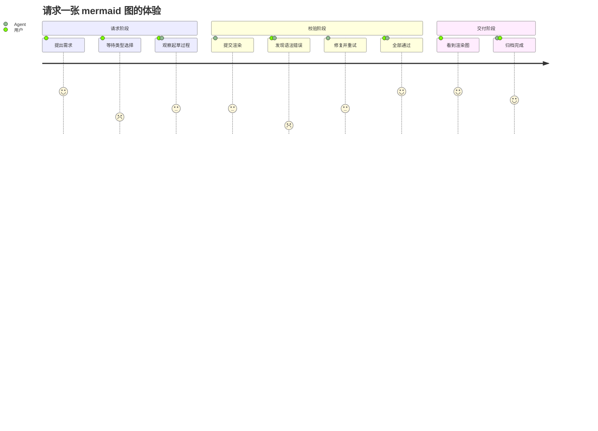

## 14 · quadrantChart

意图：按建模匹配度与实现成本评估各类图类型：左上首选（高匹配低成本），右下为高成本低匹配应避免。

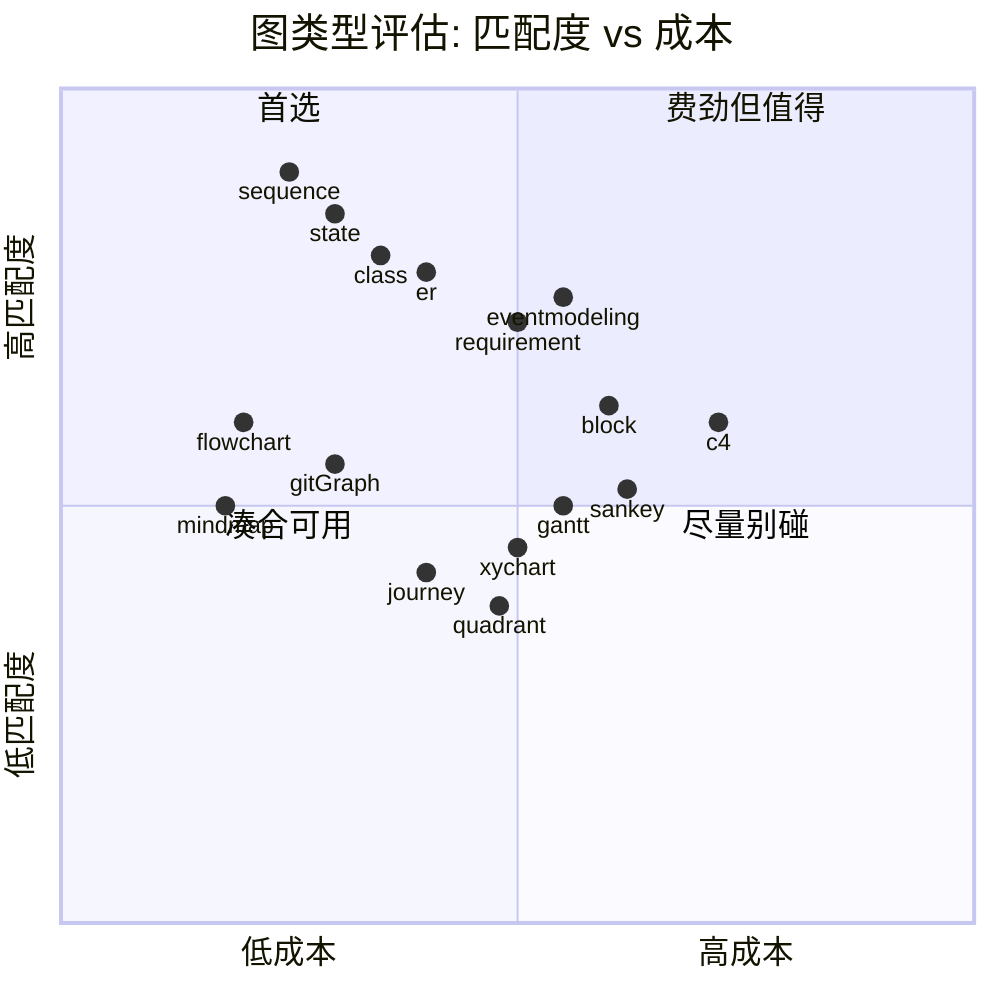

## 15 · sankey-beta

意图：测试请求按类型分发的流量，以及各类别一次通过与重试修复后的最终归档汇合，保持总量守恒。

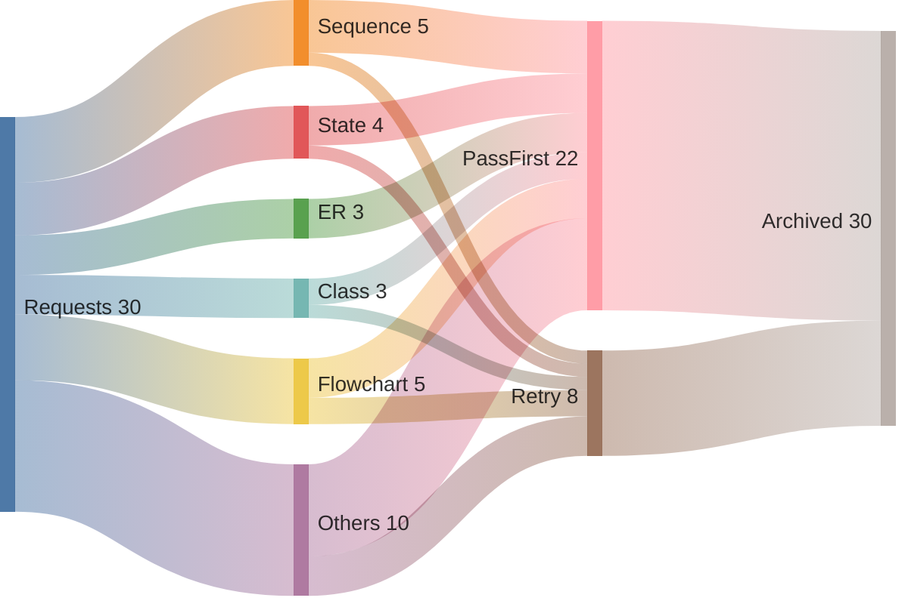

## 16 · xychart-beta

意图：对比各图类型的校验尝试次数，展示哪些类型一次通过、哪些需要重试。

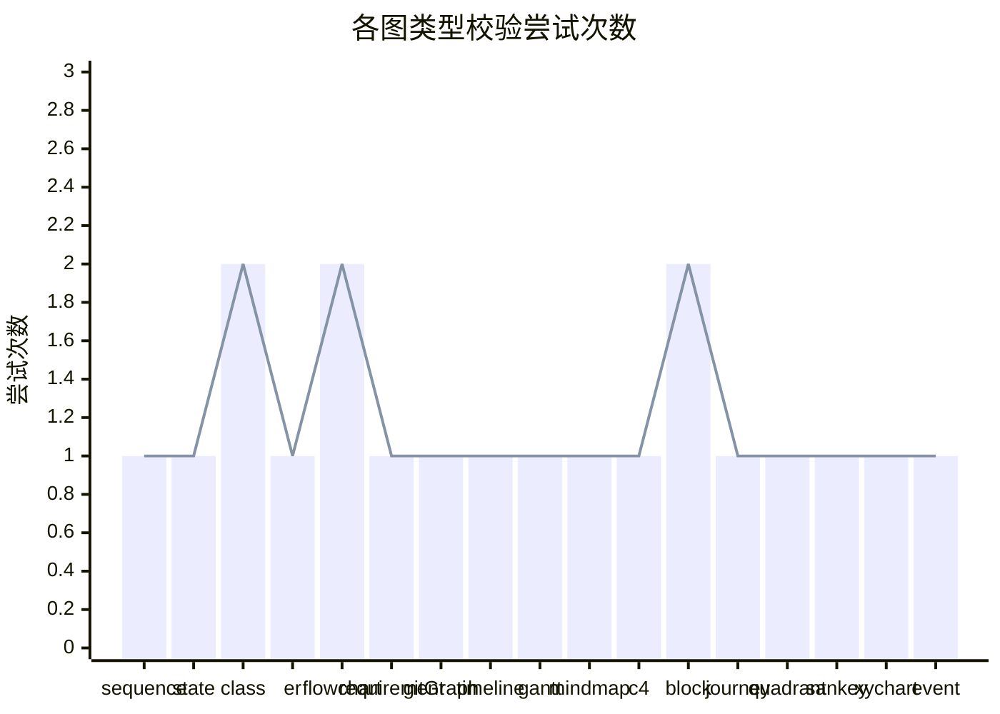

## 实战中发现的坑（已在 skill 文档之外验证）

1. **`-- "label" ==>` 组合解析失败**（flowchart）：带引号标签的粗箭头必须写成 `==>|"label"|`；skill 的 flowchart.md 未覆盖此组合。
2. **带引号的 namespace 名解析失败**（classDiagram，11.15.0 实测）：`namespace "pi-better-mermaid" {` 报 Parse error，文档示例写法不可用；改用下划线标识符 `namespace pi_better_mermaid {`。
3. **sankey CSV 节点名不支持中文**：非 ASCII 节点名直接 Lexical error；节点标签须用 ASCII。
4. **block 图不支持 `{["..."]}` 菱形内嵌**：用 `{"..."}` 或 `["..."]` 单层形状。
5. **better-mermaid 工具 frontmatter 误判**：传 `type` 参数时，frontmatter（`---`）开头会被判为图头不匹配；不传 `type`（或去掉 frontmatter）即可。
6. **并发调用竞态**：首个 better-mermaid 调用会按需初始化 mmdc，并发调用可能误报"mmdc 不可用"；串行重发即可。
7. **timeline/gantt/xyChart 等 DSL 型图**：`""` 全包裹规则仅适用于标签类字面量，数字、坐标、CSV 值、时长按 DSL 原生书写。
8. **eventmodeling 已弃用（2025-08-13）**：mermaid@11.15.0 对其渲染输出错误页（SVG 内含 "Syntax error in text"）。已从能力清单移除（16/16），skill 文档（SKILL.md / self-check / encoded-preferences / types/eventmodeling.md）同步标注弃用，evals 移除 cqrs-eventmodeling 用例；CQRS 笔记改用 `sequenceDiagram` + `box`/`alt`。
9. **门禁假阳性（已修复）**：旧版 better-mermaid 对 eventmodeling 报 pass——mmdc 退出码 0 且有 SVG 产物即判通过，但 SVG 其实是错误页。工具现已增加 SVG 内容检查（含 `error-text` / `Syntax error in text` 即判失败）。

## 复现

```bash
for f in *.mmd; do mmdc -i "$f" -o "${f%.mmd}.svg"; done
```
