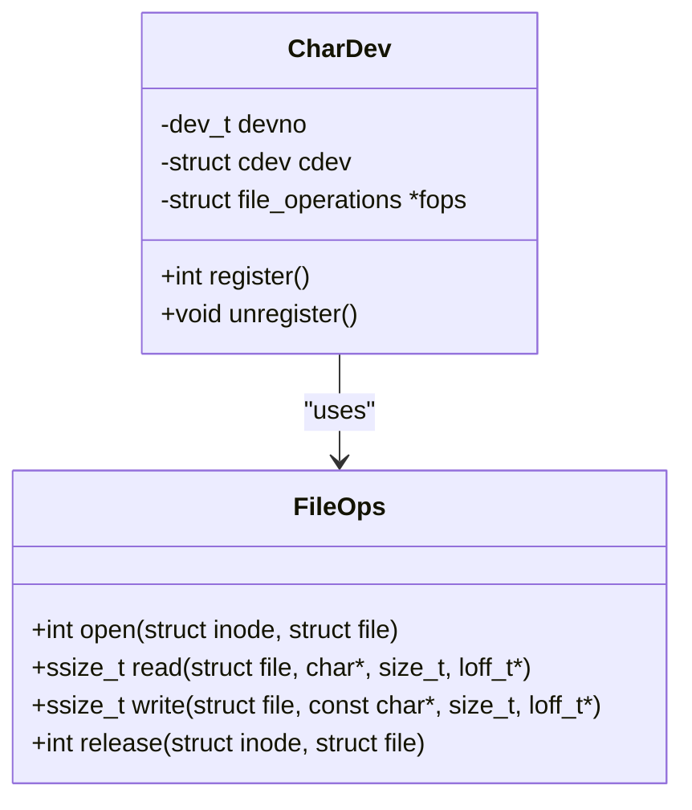

# classDiagram — deep dive

**Upstream:** `references/mermaid-docs/syntax/classDiagram.md`

**Core role.** Static type structure: classes / structs with fields and methods, plus relations between them (has-a, is-a, depends-on, uses).

**Reach for it when** modeling kernel ops vtables, OO hierarchies, struct ownership, namespace-scoped subsystems, "what types exist and how do they relate."

**Do not reach for it when** showing time-ordered calls (→ sequence) or transitions (→ state).

---

## Skeleton



Visibility prefixes: `+` public, `-` private, `#` protected, `~` package. Use them when they carry information; for kernel C code, default to `+`.

---

## Relations — pick the right arrow

| Arrow             | Meaning              | C-world analogue                              |
| ----------------- | -------------------- | --------------------------------------------- |
| `<\|--`           | Inheritance          | "is-a" (rare in C; ops-table extension)       |
| `*--`             | Composition (strong) | embedded struct (owns the lifecycle)          |
| `o--`             | Aggregation (weak)   | pointer-to-struct (refers, doesn't own)       |
| `-->`             | Association          | "uses" / dependency                           |
| `..>`             | Dependency           | weak / type-only dependency                   |
| `..\|>`           | Realization          | implements interface (e.g., fills ops vtable) |
| `--`              | Plain link           | bidirectional, semantics-free                 |

Use `*--` vs `o--` deliberately: embedded struct → `*--`; pointer to externally-owned → `o--`.

---

## Cardinality / multiplicity

```
CharDev "1" --> "*" Inode : "indexed by"
File    "*" o-- "1" Inode : "open against"
```

Quoted multiplicities (`"1"`, `"*"`, `"0..1"`, `"1..*"`) on either end. Critical for ER-like schemas.

---

## Generic types

```
class List~T~ {
    +add(T item)
    +T get(int i)
}
```

Tilde-delimited. Useful for kernel templates / `container_of`-style patterns or for Rust/C++ ports.

---

## Namespaces (v11.15.0+)

The big-impact feature in 11.15. Group classes by subsystem:

```
classDiagram
    namespace "kernel/fs" {
        class VFS
        class Inode
        class Dentry
    }
    namespace "kernel/drivers" {
        class CharDev
        class Cdev
    }

    CharDev --> Inode : "operates on"
```

Nested namespaces also supported (v11.15+):

```
namespace "kernel" {
    namespace "fs" {
        class VFS
    }
    namespace "drivers" {
        class CharDev
    }
}
```

Use `hierarchicalNamespaces: false` in config to render nested namespaces compactly. This is the *cleanest* way to draw a multi-subsystem class diagram — without namespaces it becomes a tangle.

### Annotations / stereotypes

```
class Comparable {
    <<interface>>
    +compareTo(other)
}

class AbstractDriver {
    <<abstract>>
}

class FileOps {
    <<vtable>>
}
```

The `<<...>>` slot is free-form — useful for marking `<<vtable>>`, `<<dto>>`, `<<service>>` etc.

### Lollipop interfaces

For "X exposes interface Y" diagrams:

```
class CharDev {
    +register()
}
FileOps ()-- CharDev
```

The `()--` arrow renders as a ball-and-socket "lollipop." Niche but excellent for component diagrams.

### Notes

```
note for CharDev "registered via cdev_add()"
note "global comment goes here"
```

### classDef styling

```
classDef kernelClass fill:#dde
class VFS,Inode,Dentry kernelClass
```

---

## Patterns

**Kernel subsystem map:** one `namespace` per subsystem, classes for the key structs, relations show ownership (`*--`) vs reference (`o--`).

**Ops table / vtable:** the ops struct gets `<<vtable>>`; concrete drivers `..|>` it (realize).

**Plug-in architecture:** core class with `<<interface>>`, plug-ins linked with `..|>`.

---

## Don't

- Don't draw a class with > ~8 members — pick the load-bearing ones, or split into a "core" + "extension" pair.
- Don't omit cardinalities on data-shape diagrams — `User --> Order` says nothing; `User "1" --> "*" Order` says everything.
- Don't pick `-->` when you mean `*--` / `o--` — ownership is the most informative thing on a class diagram, don't flatten it.
- Don't put method bodies / call chains on a class diagram — that's sequence.
