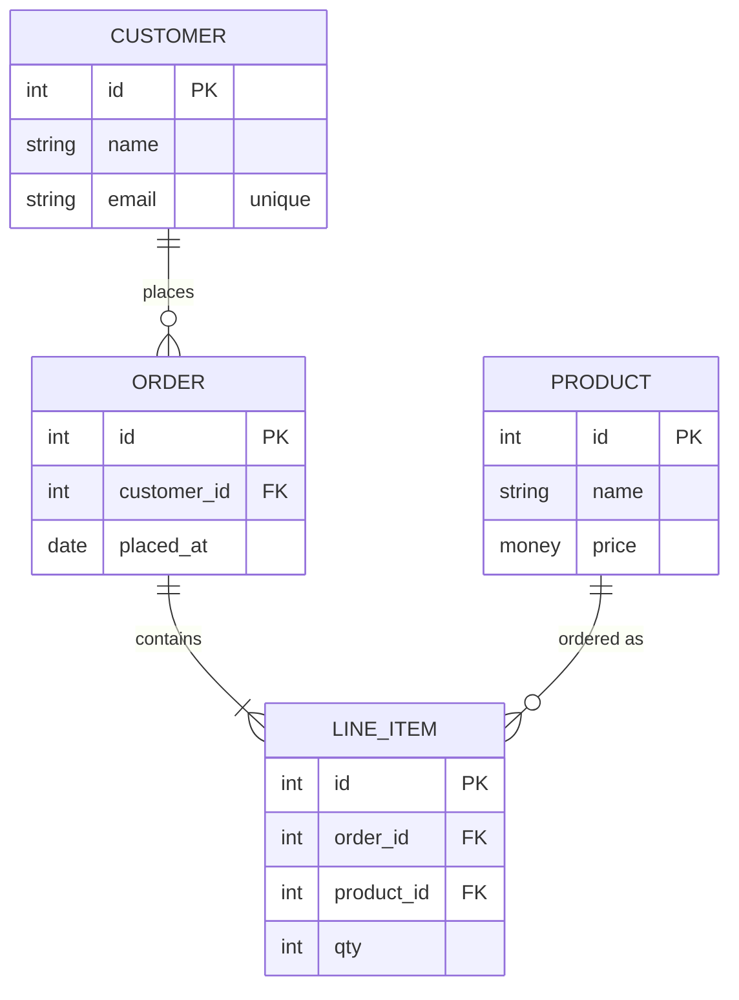

# erDiagram — deep dive

**Upstream:** `references/mermaid-docs/syntax/entityRelationshipDiagram.md`

**Core role.** Entities (think tables, structs, schema nodes) connected by relationships with explicit cardinality. The diagram makes the *shape of the data* legible — what owns what, how many of each, what's identifying.

**Reach for it when** the prose says entity / table / foreign key / has many / belongs to / cardinality.

**Do not reach for it when** the entities have meaningful behavior (use `classDiagram`) or you want time-ordered flow (use `sequenceDiagram`).

---

## Skeleton



Entity names are uppercase by convention. Attribute lines: `type name [PK|FK|UK] ["comment"]`.

---

## Cardinality — the whole point

| Left           | Right          | Meaning                              |
| -------------- | -------------- | ------------------------------------ |
| `\|\|`         | exactly one    | (mandatory, one)                     |
| `\|o`          | one or zero    | (optional, at most one)              |
| `}\|`          | one or many    | (mandatory, many)                    |
| `}o`           | zero or many   | (optional, many)                     |

Combine left + middle + right: `CUSTOMER ||--o{ ORDER` = customer has zero-or-more orders, order belongs to exactly one customer.

Middle: `--` solid (identifying — child can't exist without parent), `..` dashed (non-identifying — child exists independently).

```
ORDER  ||--|{ LINE_ITEM : "contains"      // identifying: line item dies with order
ORDER  }o..o{ COUPON    : "applies"       // non-identifying: coupons exist on their own
```

Spend the dashed/solid distinction — it's free documentation.

---

## Attribute keys & comments

```
ORDER {
    int    id          PK
    int    customer_id FK
    string status      "enum: pending,paid,shipped"
    money  total
}
```

Keys: `PK` (primary), `FK` (foreign), `UK` (unique). Quoted comment after the attribute renders as a tooltip-style note — use for invariants, enum ranges, units.

---

## Entity aliases (long display names)

```
erDiagram
    "user_account" as U {
        int id PK
        string name
    }
    "order_line" as L {
        int id PK
    }
    U ||--o{ L : "owns"
```

When the schema name is long / has underscores, alias it.

---

## Direction & styling

```
erDiagram
    direction LR
    ...
```

`LR` is usually the right choice — entity boxes are wide.

```
classDef coreEntity fill:#dde
class CUSTOMER,ORDER coreEntity
```

Color-code core / lookup / log entities when the schema is large.

---

## Patterns

**Application schema:** core entities + lookup tables (countries, currencies) + log tables (audit, events). Dashed lines to log tables (non-identifying), solid lines among core.

**On-disk struct relations (kernel/embedded):** entities for structs, FK for pointer-fields, identifying for embedded structs and non-identifying for pointers.

**Config tree:** entities for config nodes, identifying relations for sub-nodes, attributes carry types and units.

---

## Don't

- Don't omit cardinality — that's the entire reason to use an ER diagram. `A -- B` is uninformative.
- Don't put behavior on entities (no methods) — that's `classDiagram`.
- Don't draw ER diagrams with > ~10 entities at once — split by aggregate / bounded context.
- Don't use ER for read-flow / write-flow — use sequence.
