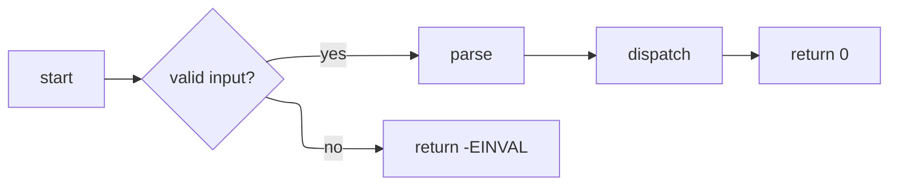

# flowchart — deep dive

**Upstream:** `references/mermaid-docs/syntax/flowchart.md` (1389 lines — the catch-all)

**Core role.** Generic boxes-and-arrows with branching. Use *only* when nothing more specific fits. If the verbs are call / state / contains / entity → another type wins.

**Reach for it when** modeling: build pipelines, decision trees, control-flow dispatch, generic system overviews that don't fit a constrained type.

---

## Skeleton



Direction: `TB` (top→bottom, default), `LR` (left→right), `RL`, `BT`. `LR` reads better for linear pipelines; `TB` for trees.

---

## Pick the right node shape

The shape *is* documentation. Don't default everything to a rectangle.

| Syntax              | Shape                       | Semantic use                         |
| ------------------- | --------------------------- | ------------------------------------ |
| `A["text"]`         | Rectangle (default)         | Step / action                        |
| `A("text")`         | Round-edged                 | Soft action / intermediate           |
| `A(["text"])`       | Stadium                     | Start / end                          |
| `A[["text"]]`       | Subroutine                  | Call into another defined process    |
| `A[("text")]`       | Cylinder                    | Database / storage                   |
| `A(("text"))`       | Circle                      | Connector / hub                      |
| `A{"text"}`         | Rhombus (diamond)           | Decision                             |
| `A{{"text"}}`       | Hexagon                     | Preparation                          |
| `A[/"text"/]`       | Parallelogram               | Input/output                         |
| `A[\"text"\]`       | Parallelogram-alt           | Input/output                         |
| `A[/"text"\]`       | Trapezoid                   | Manual operation                     |
| `A[\"text"/]`       | Trapezoid-alt               | Priority action                      |
| `A((("text")))`     | Double circle               | Stop                                 |

### Expanded shapes (v11.3.0+)

The new shape syntax supports ~30 named shapes via:

```
A@{ shape: cyl, label: "database" }
B@{ shape: doc, label: "spec.md" }
C@{ shape: das, label: "datastore" }
D@{ shape: brace, label: "comment" }
E@{ shape: bolt, label: "fast path" }
```

Common ones: `cyl` (database), `doc` (document), `docs` (multi-doc), `das` (datastore), `brace` (comment), `bolt` (com-link), `cloud`, `lin-cyl` (lined cylinder), `fr-circ` (framed circle for stop), `sm-circ` (small start circle), `lin-rect` (lined process), `hourglass`, `delay`, `paper-tape`, `card`.

See upstream `syntax/flowchart.md` → "Complete List of New Shapes" for the full table. Use them to give each node a meaningful glyph instead of stamping rectangles.

---

## Edges

```
A --> B            // solid arrow
A --- B            // solid no-arrow
A -.-> B           // dotted arrow
A ==> B            // thick arrow
A -- "label" --> B // labeled
A -->|"label"| B   // labeled (alt form)
A -.->|"label"| B  // dotted labeled
A o--o B           // circle ends both sides
A x--x B           // cross ends both sides
```

Use `==>` thick arrows for "happy / primary path" emphasis, and `-.->` for "fallback / optional" edges — the reader picks up the hierarchy at a glance.

---

## Subgraphs — the structuring tool

```
flowchart LR
    subgraph user_space ["userspace"]
        direction TB
        App["app"]
        Lib["libc"]
    end

    subgraph kernel_space ["kernel space"]
        direction TB
        Sys["syscall"]
        Drv["driver"]
        Hw["hw"]
    end

    App --> Lib --> Sys
    Sys --> Drv --> Hw
```

Subgraphs are the cure for "everything at the top level." Each subgraph can declare its own `direction`. Group by ownership, layer, or lifecycle stage.

### Subgraph ordering with invisible edges

When multiple subgraphs have no inter-subgraph edges, the layout engine may place them in an unexpected order. Use `~~~` (invisible edge) to create a hidden layout chain that enforces the desired sequence:

```
flowchart TD
    subgraph s1["第一阶段"]
        A["step 1"] --> B["step 2"]
    end

    subgraph s2["第二阶段"]
        C["step 3"] --> D["step 4"]
    end

    subgraph s3["第三阶段"]
        E["step 5"] --> F["step 6"]
    end

    s1~~~s2
    s2~~~s3
```

- `~~~` creates a **structural connection the layout engine respects** but renders no visible line.
- For `TD` (top→bottom): subgraphs order left→right, top→bottom.
- For `LR` (left→right): subgraphs order top→bottom, left→right.
- Name the subgraph IDs (`s1`, `s2`, `s3`) sequentially to make the chain self-documenting.
- This also works with `flowchart-elk` when ELK layout is active.

---

## Layout

For > ~12 nodes, set ELK in frontmatter:

```
---
config:
  layout: elk
  look: handDrawn   # optional, neutral default is fine
---
```

ELK gives orthogonal routing and dramatically fewer edge crossings. For ≤ ~8 nodes, default Dagre is fine.

---

## Styling

```
classDef happy fill:#dfd,stroke:#2a2
classDef sad   fill:#fdd,stroke:#a22

A["start"]:::happy --> B["fail"]:::sad
class A,C,E happy
```

Use sparingly — color-code a meaningful axis (success/error, fast/slow, sync/async) rather than every node.

### Markdown labels

```
A["**bold step**<br/>with details"]
```

Backticks inside `""` for code spans don't always render — prefer the *Markdown String* style on a separate line when needed (see upstream `flowchart.md` → "Markdown formatting").

---

## Patterns

**Layered system overview:** outer subgraphs per layer, inner subgraphs per component, edges only across layers.

**Decision tree:** rhombus nodes for branches, edge labels `"yes"` / `"no"` / `"timeout"`, stadium nodes for terminal outcomes.

**Build pipeline:** parallelogram for inputs (sources), rectangles for stages, cylinder for cache, stadium for output artifacts. Use `==>` for the critical path.

---

## Don't

- Don't use `flowchart` when the diagram is *actually* one of: sequence (call/return between actors), state (current-state + transitions), class (types and relations), ER (entities + cardinality). Re-pick.
- Don't put 15 nodes at the top level — group with subgraphs.
- Don't make every node a default rectangle — shape is information; spend it.
- Don't omit edge labels on decision branches — `A{B} -->|"yes"| C` is twice as readable as a bare arrow.
- Don't mix abstraction levels at the top — subsystems and individual functions don't belong as siblings.
