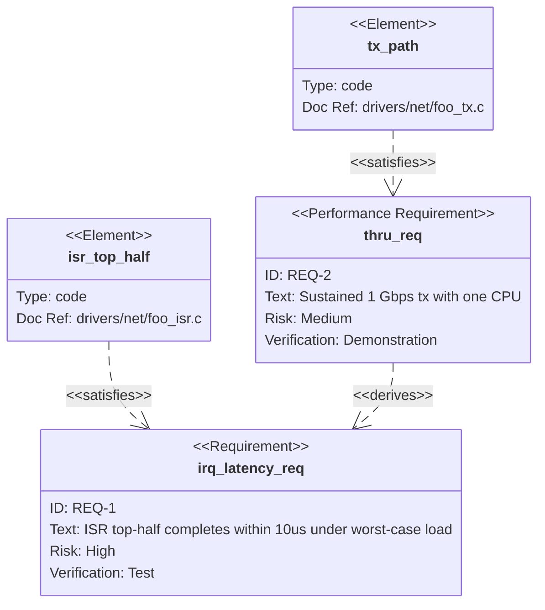

# requirementDiagram — deep dive

**Upstream:** `references/mermaid-docs/syntax/requirementDiagram.md`

**Core role.** Trace requirements against design elements and against verification: "requirement R is satisfied by element E, verified by test T, depends on assumption A."

**Reach for it when** writing SRS-style notes, certifying that a feature meets a spec, or building a compliance / verification map.

**Do not reach for it when** you just want a bullet list of requirements — that's prose, not a diagram. The diagram earns its place only when there are *relations* worth visualizing.

---

## Skeleton



---

## Typed requirements

| Keyword                       | Semantic                                       |
| ----------------------------- | ---------------------------------------------- |
| `requirement`                 | Generic                                        |
| `functionalRequirement`       | Behavioral / functional                        |
| `performanceRequirement`      | Throughput / latency / capacity                |
| `interfaceRequirement`        | API / protocol surface                         |
| `physicalRequirement`         | Hardware / form-factor                         |
| `designConstraint`            | Imposed constraint (compliance, regulatory)    |

Pick the most specific — the icon / outline changes accordingly and adds visual structure for free.

## Risk levels

`risk: low | medium | high`

## Verification methods

`verifymethod: analysis | inspection | test | demonstration`

## Elements

`element "name" { type: "..."  docref: "..." }`

`type` is free-form — typical values: `code`, `module`, `service`, `hardware`, `document`.

`docref` is a free-form pointer back to source (file path, URL, ticket ID).

---

## Relation arrows

```
A - contains   -> B
A - copies     -> B
A - derives    -> B
A - satisfies  -> B
A - verifies   -> B
A - refines    -> B
A - traces     -> B
```

Pick the strongest accurate verb: `satisfies` for "design element implements requirement"; `verifies` for "test validates"; `derives` for "lower-level requirement derived from higher-level"; `traces` only when nothing stronger applies.

Identifier-or-quoted strings on both sides — quoting is safe and recommended.

---

## Direction & styling

```
requirementDiagram
    direction LR
```

The default rankdir is fine for small graphs; reach for `LR` when the trace gets wide.

```
classDef hi fill:#fdd
class "irq_latency_req" hi
```

Color-code high-risk requirements.

---

## When NOT to draw one

Requirement diagrams are heavy. Don't draw one for:

- A single requirement (just write prose).
- A flat list with no `satisfies` / `verifies` / `derives` arrows — the *relations* are what justify the diagram.
- "What does my code do" — that's a flowchart / sequence.

Draw a requirement diagram only when there are ≥ 3 requirements *and* ≥ 1 design element *and* the trace links are non-trivial.

---

## Patterns

**Compliance trace:** high-level `designConstraint` → derived `functionalRequirement` → element with `docref` to source → test element with `verifies`.

**Cross-team handoff:** `interfaceRequirement` between two subsystems, satisfied by each side's element.

**Spec → tests:** one `verifies` edge per test for each requirement; quickly reveals untested requirements (no incoming `verifies` arrow).
