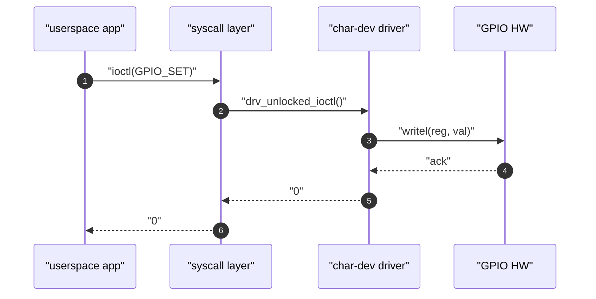

# sequenceDiagram — deep dive

**Upstream:** `references/mermaid-docs/syntax/sequenceDiagram.md` (853 lines, authoritative)

**Core role.** Time-ordered message exchange among a fixed set of actors. The y-axis is *time*, not control flow — distinguish from `flowchart` by this alone.

**Reach for it when** the natural prose verbs are call / return / send / receive / wait / await / ack / handle / dispatch.

**Do not reach for it when** the natural verbs are enter / exit / transition / on event (→ `stateDiagram`) or has-a / inherits / contains (→ `classDiagram`).

---

## Skeleton (always start here)



Rules already burned in: `autonumber` on line 2; every literal `""`-wrapped; arrows use `->>` (solid open) for calls, `-->>` (dashed open) for returns. The full arrow palette is in upstream `## Messages → Supported Arrow Types` — `->` `-->` `->>` `-->>` `-x` `--x` `-)` `--)`.

---

## Advanced primitives — use ≥ 1, ideally several

These are what make a sequenceDiagram earn its place. A diagram with none of them is a doodle.

### `alt` / `else` — mutually exclusive branches

```
alt "buffer non-empty"
    Drv -->> App: "copy_to_user(...)"
else "blocking read, no data"
    Drv -->> App: "-EAGAIN"
end
```

### `opt` — optional branch

```
opt "verbose mode enabled"
    Drv ->> Log: "trace_event()"
end
```

### `loop` — repetition

```
loop "until ringbuffer drained"
    Drv ->> Hw: "read_fifo()"
    Hw -->> Drv: "byte"
end
```

### `par` — parallel branches

```
par "ISR top half"
    Hw ->> ISR: "irq raised"
    ISR ->> Wq: "queue_work()"
and "userspace polling"
    App ->> Sys: "poll()"
end
```

### `critical` — atomic region with optional `option` failure handlers (v9.4+)

```
critical "establish lock"
    A ->> B: "mutex_lock()"
option "lock contended"
    A ->> B: "wait"
option "lock owner crashed"
    A ->> B: "EOWNERDEAD"
end
```

### `break` — non-local exit

```
break "fatal error"
    A -->> B: "EFAULT"
end
```

### `note` — annotations (left of / right of / over)

```
note over App,Drv: "user/kernel boundary"
note right of Drv: "spin_lock held"
note left of App: "blocking until signal"
```

### `rect rgb(R,G,B)` — region highlight

Group a related cluster (happy path, error path, kernel region) — **every channel > 200**:

```
rect rgb(220, 245, 220)
    App ->> Drv: "open()"
    Drv -->> App: "fd"
end
```

### `activate` / `deactivate` — lifeline activation

Or the shorthand `+`/`-` on arrows:

```
App ->>+ Drv: "write()"
Drv ->>+ Hw:  "writel()"
Hw -->>- Drv: "ack"
Drv -->>- App: "n"
```

### Actor creation / destruction (v10.3+)

```
participant App
create participant Worker as "kworker"
App ->> Worker: "spawn"
destroy Worker
Worker -->> App: "exit"
```

### Participant types (visual differentiation)

```
participant Db as "database"
actor       Usr
boundary    Api as "REST API"
control     Ctrl as "service"
entity      Cache
database    Db
collections Q as "msg queue"
queue       Bus
```

Use these instead of plain `participant` when you want the icon to read at a glance — e.g., `database` for a real DB, `queue` for an msg bus, `boundary` for the API boundary.

### Grouping with `box`

```
box "kernel space"
    participant Sys
    participant Drv
    participant Hw
end
box "userspace"
    participant App
end
```

`box` visually groups participants — great for showing kernel/user boundary.

### Autonumber with custom start/increment (v11.15.0+)

```
sequenceDiagram
    autonumber 10 5
```

Starts at 10, increments by 5. Useful when continuing numbering across multiple diagrams in the same note.

---

## Composition patterns

**Kernel ↔ user round-trip:** `box "userspace"` + `box "kernel space"` + `note over` at the boundary + `rect rgb(220, 230, 250)` over the kernel region.

**Sync + async fan-out:** open with `App ->>+ Server: "request"`, use `par` for the fan-out, close with `Server -->>- App: "aggregated"`.

**Retry loop with break:** `loop "up to 3 times"` containing `alt "success"` (with `break`) `else "fail"` (continue).

**Optional pre-check:** `opt "first call"` for one-time setup, followed by the steady-state arrows.

---

## Don't

- Don't draw a `sequenceDiagram` of length 3 with no notes / no alt / no rect — that's a doodle. Either remove the diagram or add modeling.
- Don't use `sequenceDiagram` for a state machine (`idle -> running -> done`) — use `stateDiagram-v2`.
- Don't put concurrent / overlapping flows on the same `par` branch unless they truly happen in parallel. Sequence is for ordering.
- Don't forget the `+`/`-` activations on long-lived calls — they make scoping obvious to the reader.
- Don't bury the boundary. If kernel/user or process/thread is interesting, mark it explicitly with `box` or `note over`.
