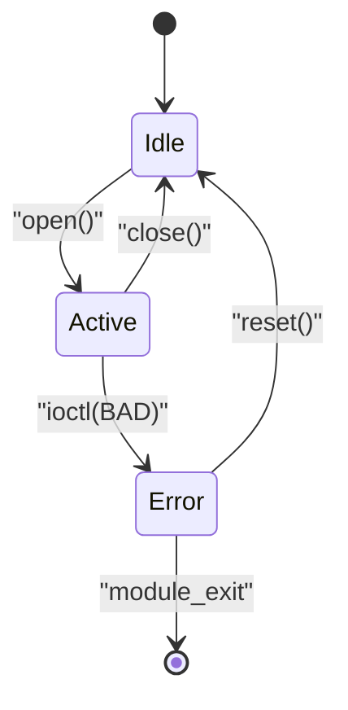

# stateDiagram-v2 — deep dive

**Upstream:** `references/mermaid-docs/syntax/stateDiagram.md`

**Core role.** A finite-state machine: named states with entry/exit transitions on named events. Time is *implicit*; what matters is which state is current and which transitions are reachable.

**Reach for it when** the prose says enter / exit / on event / in state X / transition / lifecycle.

**Do not reach for it when** there's no "current state" concept — pure decision trees / pipelines belong in `flowchart`.

> Always use `stateDiagram-v2`, never the legacy `stateDiagram`. The v2 layout is dramatically better.

---

## Skeleton



`[*]` is the implicit start/end. Every transition label is `""`-wrapped per encoded preferences.

---

## Advanced primitives

### Composite (nested) states

Hide internal structure behind a single outer state — collapsible mental abstraction:

```
stateDiagram-v2
    [*] --> Driver

    state Driver {
        [*] --> Probed
        Probed --> Bound: "bind()"
        Bound --> Probed: "unbind()"
        Bound --> [*]: "module_exit"
    }
```

The outer reader sees "Driver"; opening the composite reveals the lifecycle. This is the *single most underused* state-diagram feature.

### Concurrent regions (`--`)

Two orthogonal state machines that progress independently inside the same composite:

```
state PowerMgmt {
    [*] --> CpuIdle
    CpuIdle --> CpuActive: "wake"
    CpuActive --> CpuIdle: "idle"
    --
    [*] --> ClockOff
    ClockOff --> ClockOn: "enable"
    ClockOn --> ClockOff: "disable"
}
```

The `--` separator splits regions; both run in parallel inside `PowerMgmt`. Perfect for "the device has both a power state *and* a clock state."

### Choice (`<<choice>>`) — guarded branch

```
state guard <<choice>>
Active --> guard
guard --> Success: "rc == 0"
guard --> Failure: "rc != 0"
```

Cleaner than two transitions out of `Active` when the branch *depends on a condition*, not on a separate event.

### Fork / Join (`<<fork>>` / `<<join>>`) — splitting flow

```
state fork1 <<fork>>
state join1 <<join>>
Boot --> fork1
fork1 --> CpuInit
fork1 --> ClockInit
CpuInit --> join1
ClockInit --> join1
join1 --> Running
```

Use when two state-progressions truly proceed in parallel from a common point.

### Notes (annotations)

```
note right of Active: "irq enabled here"
note left of Error: "always reachable from any state"
```

### Direction

```
stateDiagram-v2
    direction LR
    ...
```

`LR` (left-to-right) is usually more readable than the default `TB` for linear lifecycles.

### classDef styling

```
stateDiagram-v2
    classDef errorState fill:#fdd
    classDef happyState fill:#dfd

    Idle --> Active
    Active --> Error
    Error --> Idle

    class Error errorState
    class Idle,Active happyState
```

Or inline with `:::`:

```
Active --> Error:::errorState
```

Use sparingly — when there's a meaningful classification (error vs. normal, fast-path vs. slow-path).

---

## Patterns

**Driver lifecycle:** composite state for the module, sub-states for probed/bound/unbound, `[*]` arrows for module_init/exit.

**Connection state machine (TCP-ish):** linear chain `[*] → SynSent → Established → FinWait1 → ...` with side transitions for `RST`.

**Power + clock state (orthogonal):** composite with `--` regions, one per orthogonal axis.

**Initialization fan-out:** `<<fork>>` + `<<join>>` for parallel init paths converging on `Running`.

---

## Don't

- Don't draw "step 1 → step 2 → step 3" as a state diagram — that's a flowchart. State diagrams imply *each box is a sustained mode you can return to*.
- Don't put unrelated parallel concerns inside the same outer state without `--` regions; concurrency must be explicit.
- Don't omit `[*]` at the boundaries; without them, the reader can't tell where the lifecycle starts/ends.
- Don't nest composites > 2 deep — at 3 levels readability collapses; split into multiple diagrams instead.
